## 信号 k 线

## 信号k线&入场（1）

一般来讲做反转时需要信号 k线的帮助，不管是大趋势的反转，还是顺大逆小的小反转。

顺大逆小；左边有一段上涨趋势，右边一段小回调。顺上涨趋势，逆回调。

## 趋势 k 线；

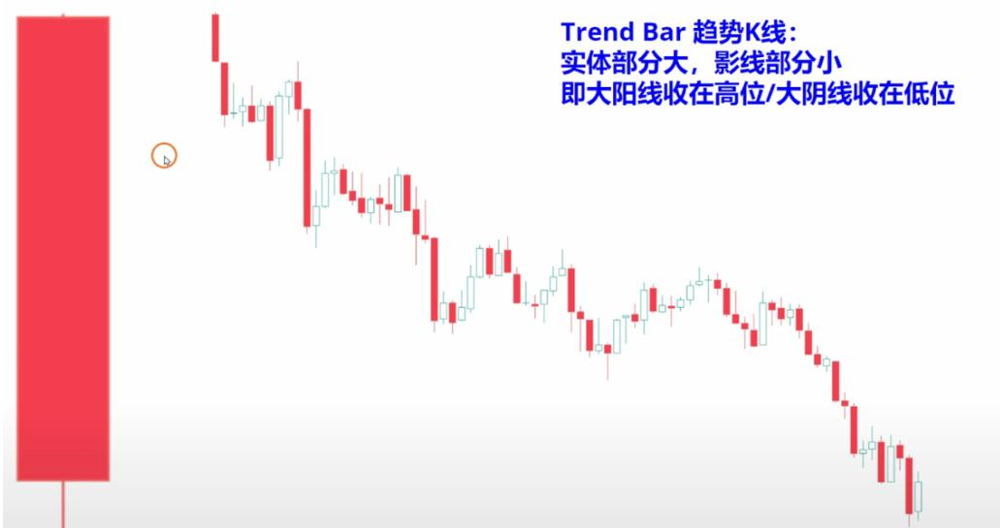  
实体大，影线小。即大阳线收在高位/大阴线收在低位。

## 震荡 k 线；

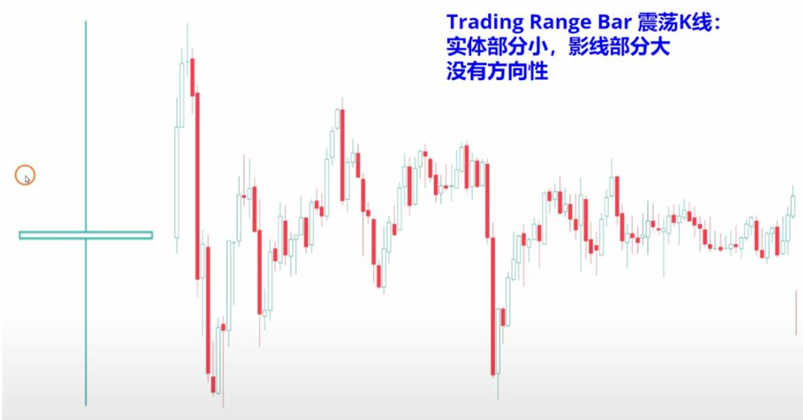  
实体小，影线大。没有方向性/趋势性。  
趋势 k线是比较好的信号 k线。

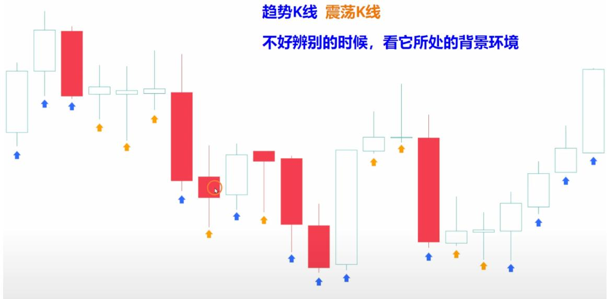  
不好区分时看当前处在什么背景。背景是趋势的话，即便 k线总体很小也是趋势 k 线。背景是震荡区间的话，即使 k 线总体很大也是非趋势 k 线。

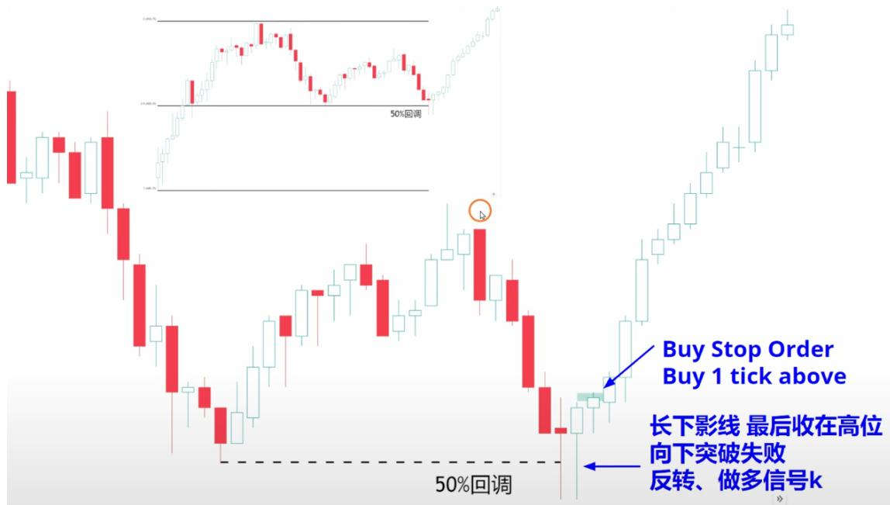  
左边是强上涨趋势，当前位置处于上涨趋势50%回调处。

50%回调位置很重要，往往会有支撑与阻力（需要看到信号判断）。

等信号k线再入场。

图中50%处，尝试下破失败后收了回来，且在相对比较高的位置收盘（突破失败的信号k线，反转可开多）。看到信号k线后不要急着入场，等待信号k线最高点被突破。

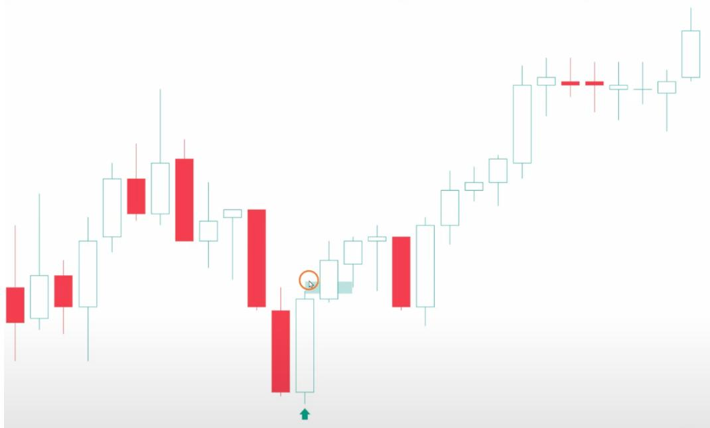

连续两根大阴线收在最低，好像是强势突破了前低。是否可以做空要看后期跟随。后期跟随很差（底部绿色箭头处），没有阴线继续确认突破。大阳线收在相对高点的位置（做多信号k线），可以在这根阳线上方挂突破单买入。

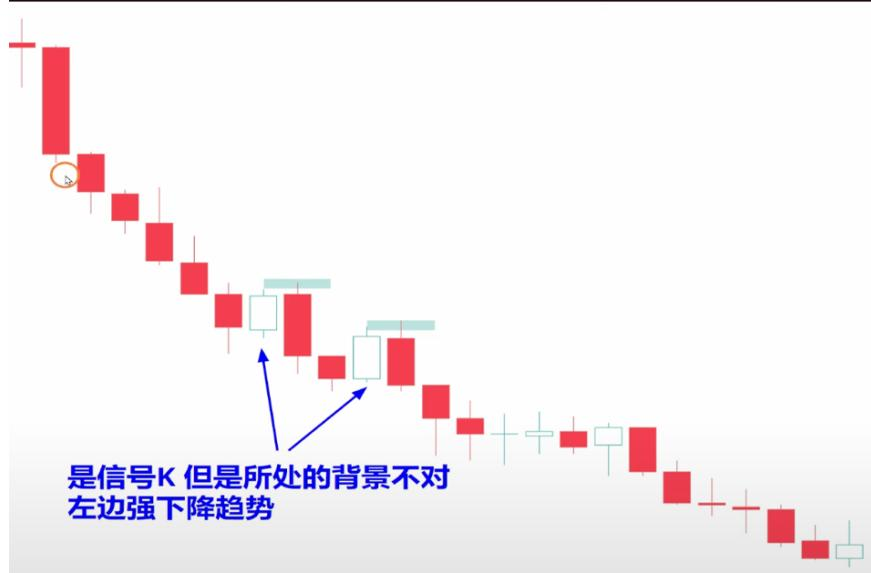

环境（所处位置）很重要。 虽然图中的两根阳线都收在高位，也确实是多头反转信号k线，但是它们所处的环境是一个非常强的下降趋势（下降窄通道）。这个时候尽管它们是信号 k线，但是大概率只是下降过程中的一次小的反弹而已。

这种强趋势的第一次反转 80%都会失败。

只做空不做多。

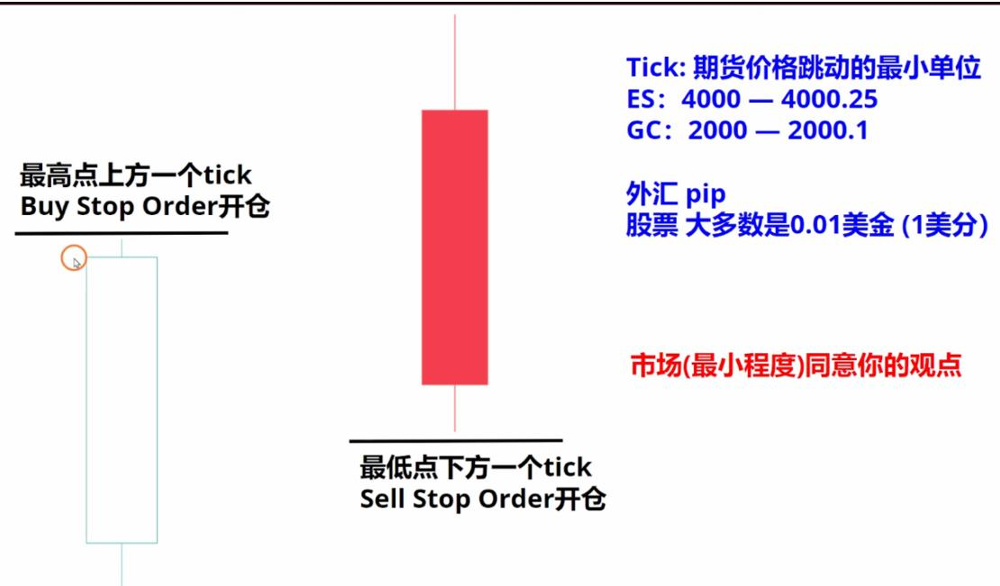

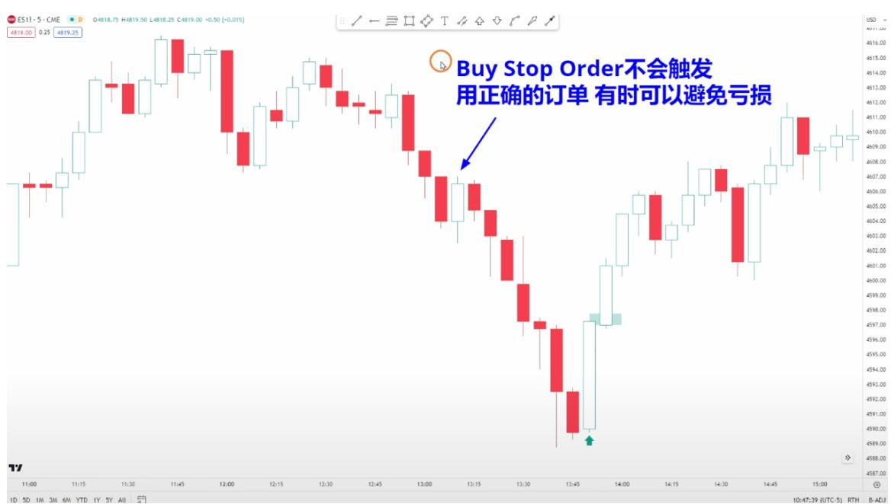

在强势空头行情下，必须要看到一个非常好的大阳线，或者是连续的阳线才更加稳妥。

单独一根阳线是肯定不够的，至少看到连续的三根阳线。

或者收盘在 EMA20 上方。

反转才可能成功。

此图，底部出现巨大阳线，吞没了前面的两根阴线。这根阳线上方突破处是一个合理的做多位置。就算后续未能向上反转，行情也不会继续向下大跌，大概率走一个震荡区间。因此，在此处小仓位做多逢低加仓的话，几乎不会有大的亏损。越是强的趋势，想要反转它越需要一个好的反转信号 k线。

好的做多信号K:

$$
\boxed { \begin{array} { c c } { { } } & { { } } \\ { { } } & { { } } \\ { { } } & { { } } \end{array} } \begin{array} { c c } { { \boxed { \begin{array} { c c } { { 1 } } \\ { { } } \\ { { } } \end{array} } } } & { { } } \\ { { \boxed { \begin{array} { c c } { { } } & { { } } \\ { { } } \end{array} } } } & { { } } \end{array}
$$

下降趋势中的长下影阴线不是做多信号K

一般但可以接受的做多信号K:

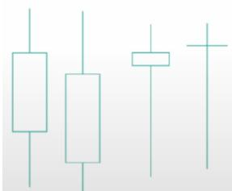

强趋势下的反转必须要好的信号k。如果要做一般信号k，最好在其顶部挂突破单。

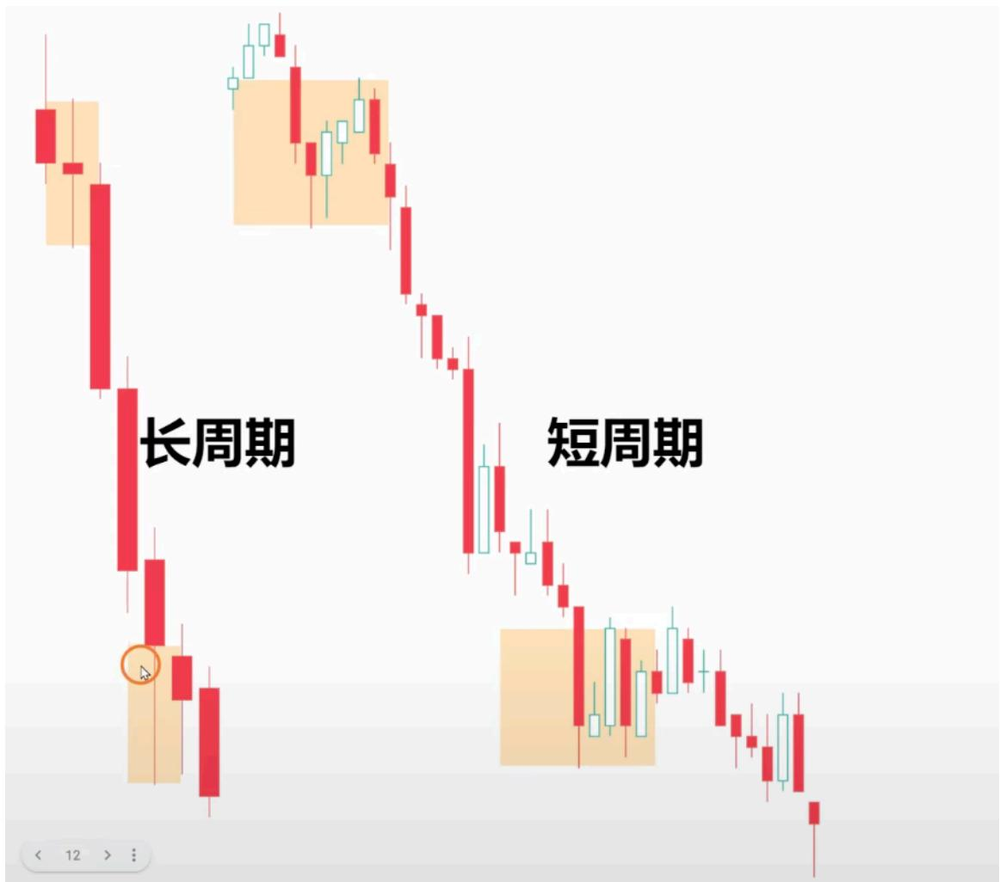

在上涨趋势中

Always In Long:只做多不做空

. 市价买入

买突破— buy stop order

买阳线收盘－赌趋势继续

买阴线收盘一赌空头反转失败

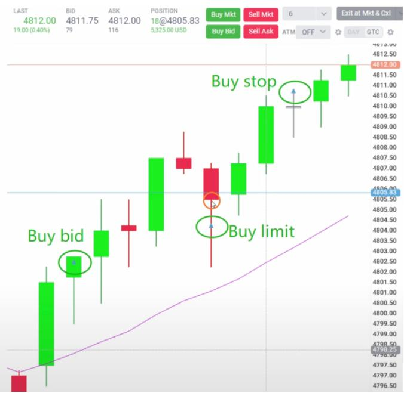

反转时才需要信号 k。如果是一个强趋势，只做多不要去做空。

如图中间的长下影线的阴线。它在下降趋势中代表一次反弹，不能去做多。但是它在强上涨趋势中，则代表空头尝试去卖空，但是力量很弱。这个时候可以买它的收盘做多，赌趋势会继续延续。

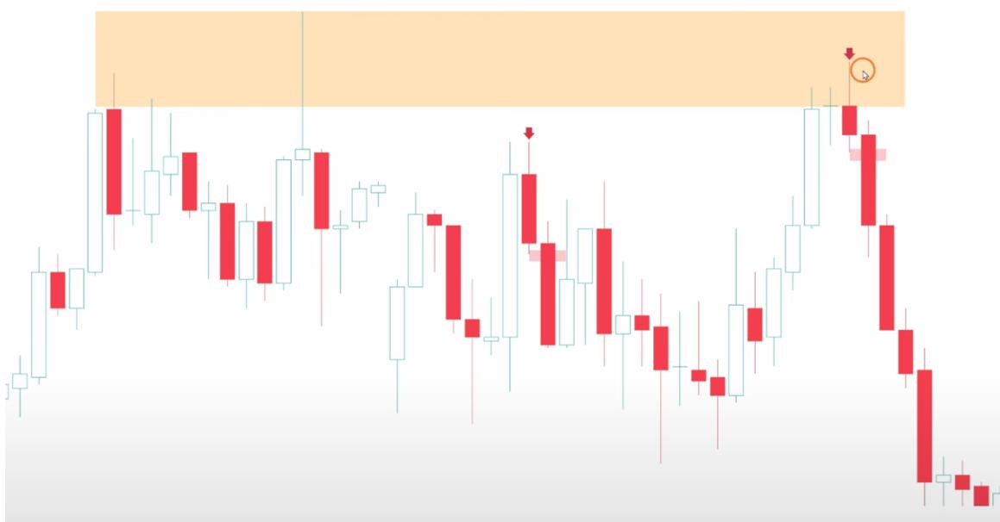

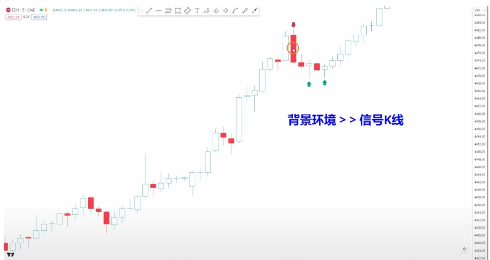

## 背景环境大于信号k 线。

强多头趋势下，出现了一根大阴线，吞没了前面阳线。可能只是多头止盈所引起的。真正是否有卖出力量要看后期走势。后期没有良好的大阴线进行跟随，因此判断只是趋势的一次回调而已。

另外，绿色箭头两根阳线虽然并不完美，但是在强多头趋势下也是可以接受的，介入做多后期待趋势可以延续，至少回到前期高点处。

顺势可以不是很完美，逆势要尽可能的完美。

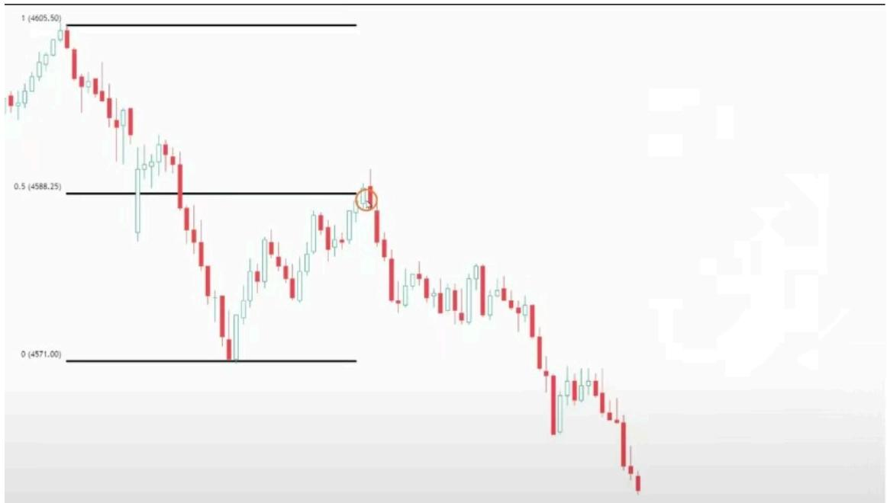

下降趋势50%反弹处。  
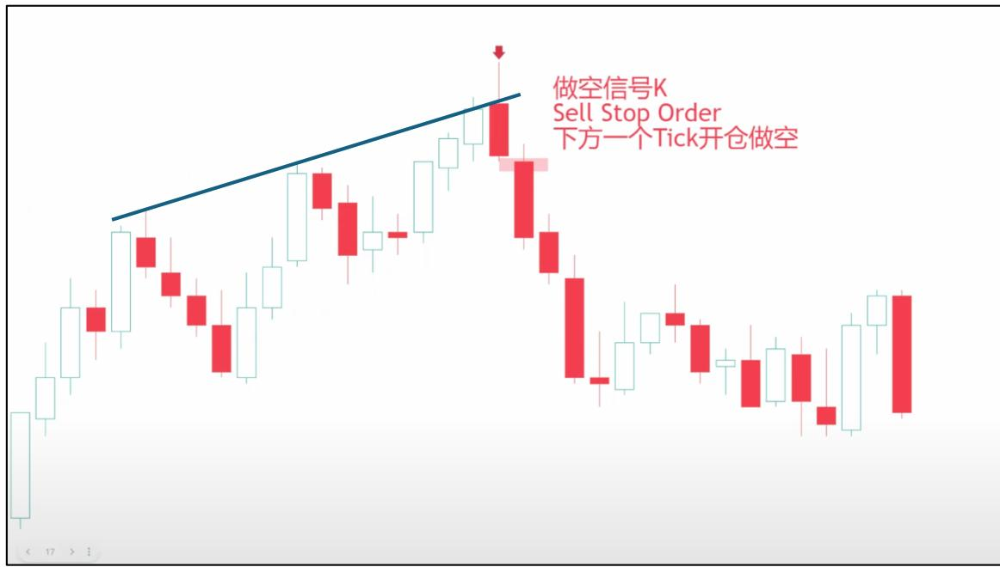  
这段走势前面是一段空头趋势。在50%处出现了三推的楔形熊旗，看到这根做空信号k线后，可以在下方挂突破单做空。

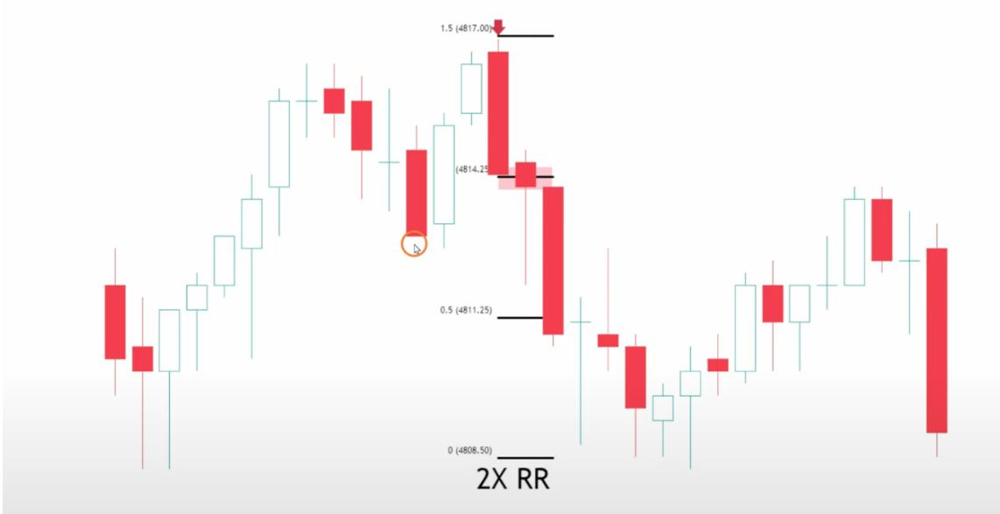  
类似一个双顶形态，顶部红色箭头处出现了吞没形态，此时可以介入做空。

前期高点处已经进行了一波比较深度的回调。这种背景下，当多头尝试向上创新高后立刻下跌，且出现了很好的信号k线时，可以做空，胜率也很高。

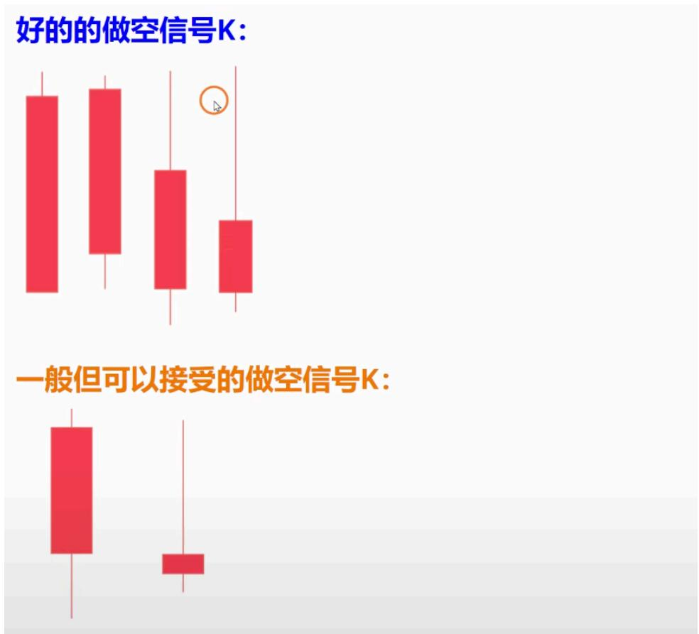

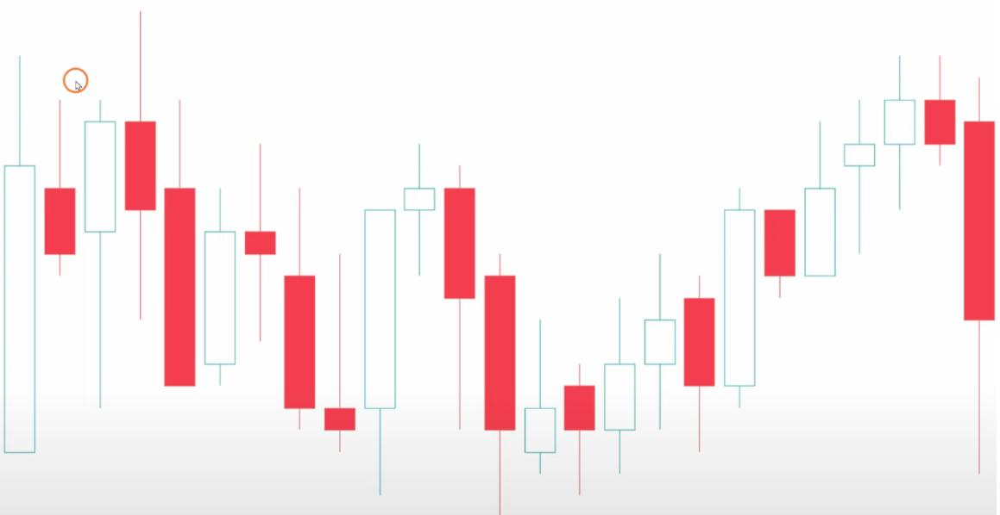  
做反转时，需要大阴/阳线收在低/高位，是好的反转信号。

但是如果处在震荡区间内的话，反而会被马上反转。大阳线收在最高被卖下去，大阴线收在最低被买上来。一定要等待突破，或者高抛低吸。

总结；

反转需要信号k线。

前面趋势越强，反转信号 k 线的力度也要越强

如何分析信号k的好坏

背景大于信号 k

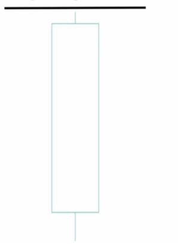

## 补充；

绝大多数交易者，特别是新手更应该用 stop order 开仓

最高点上方一个tickBuy Stop Order开仓

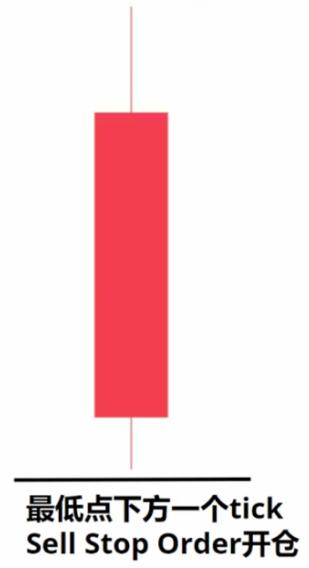  
Tick:期货价格跳动的最小单位ES: 4000— 4000.25GC: 2000 - 2000.1  
外汇pip股票大多数是0.01美金(1美分)  
市场(最小程度)同意你的观点

下降趋势；出现一根大阳线。比起收盘直接买入，在这根大阳线的最高点上方1 个tick挂突破单更好。

上涨趋势；出现一根大阴线。比起收盘直接卖出，在这根大阴线的最低点下方1 个tick挂突破单更好。

tick；期货价格跳动的最小单位。

做反转需要市场同意你的观点。至少超过前面一个 tick。

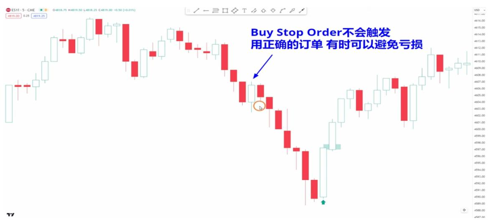

类似这里下降趋势后出现一根大阳线。可能这里有支撑。在这个阳线最高点上方挂单，后续没有触发。避免了一次亏损。

## 时间？品种？

价格行为适合任何品种、任何周期。

信号k线&入场（2）  
双 k 线反转；  
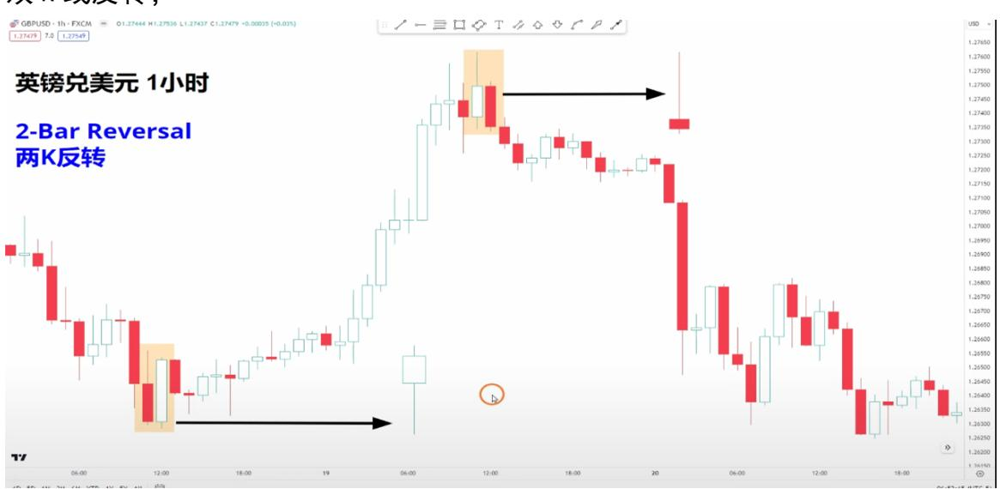

图中顶部/底部的两根 k线组合，在更大时间周期上组成了良好的单k线反转信号 k 线。

突破失败在第二根 k 线才能看清楚。

在上方/下方挂突破单。

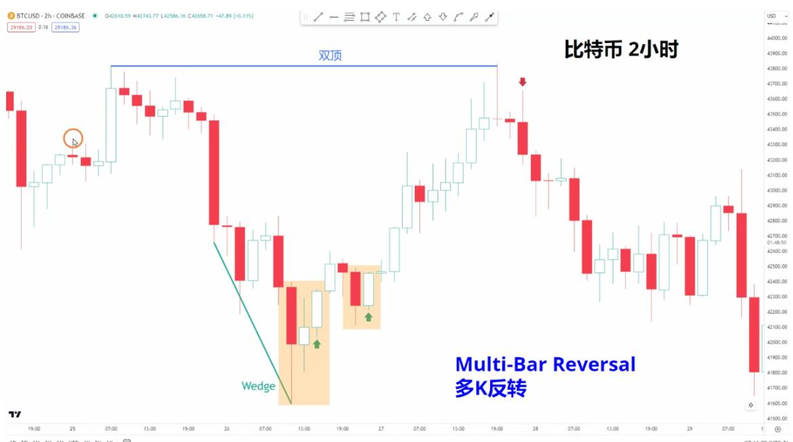

向下走了三推楔形。底部三根 k 线组成了一个向下突破失败的反转信号 k 线。顶部有个双顶。结合背景，最高点的十字星也可以入场。稳妥可以等红色箭头大阴线收盘后，在它的下方一个 tick 挂突破单入场。

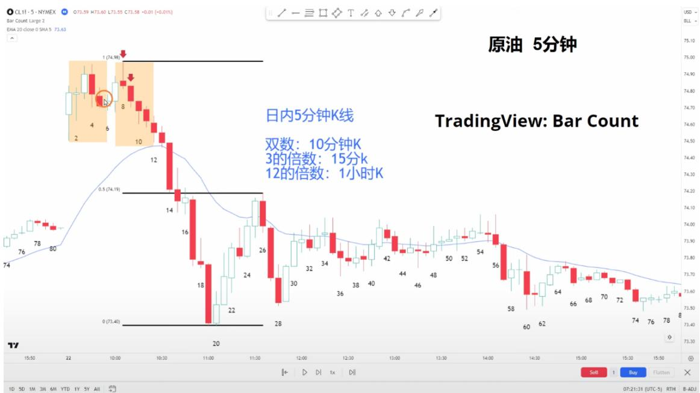

看到几根 k 线，可以知道它们在大级别/小级别的样子。（这里其实切换下周期看更直接）。

孕线&吞噬线；

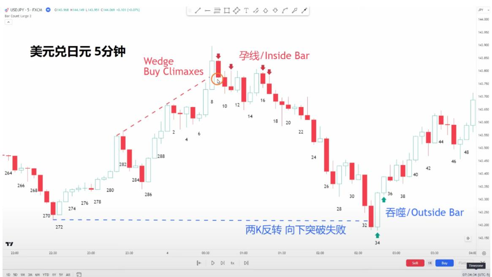

孕线；最高和最低点被前一根 k线包裹。

吞噬线；最高和最低点将前一根k线包裹。

本质都是双k线反转。

重点看所在的位置，位置很关键。

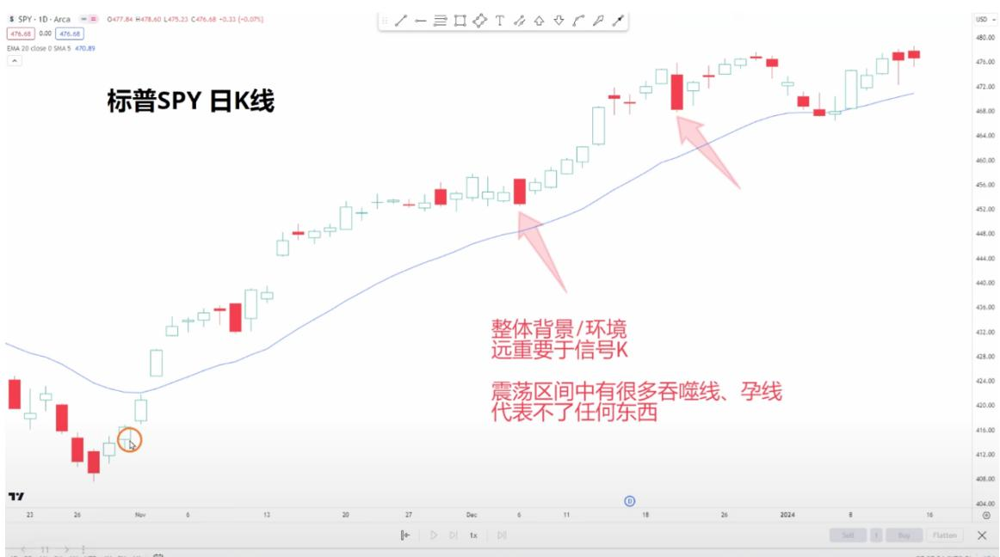

虽然多次出现空头吞噬线，但是目前多头趋势，上涨及其强劲，第一个红色箭头处，明显处于一个窄幅震荡空间当中，因此吞噬线代表不了什么。

整体背景/环境，远重要于信号 k 线。  
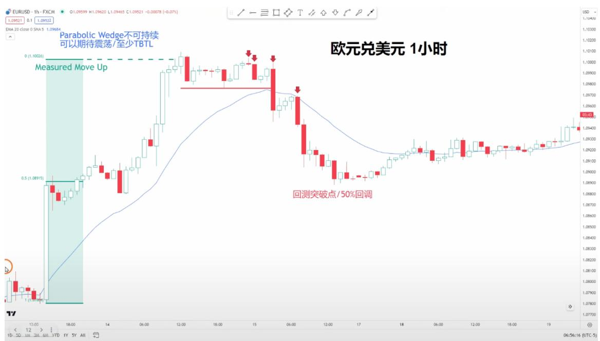

一根超大阳线收在最高，对之前的形态进行的强势突破。（强势突破后 60%概率走出等距行情），后续刚好达到。

达到目标位后，出现吞噬线尝试向下反转，在这种强趋势环境下，第一次的尝试反转大概率是失败的。因此第一个入场点尽量不要去做，它更可能是多头达到目标位止盈所引起的回调。

后续看到大阴线入场，当区间，或当双顶都可。

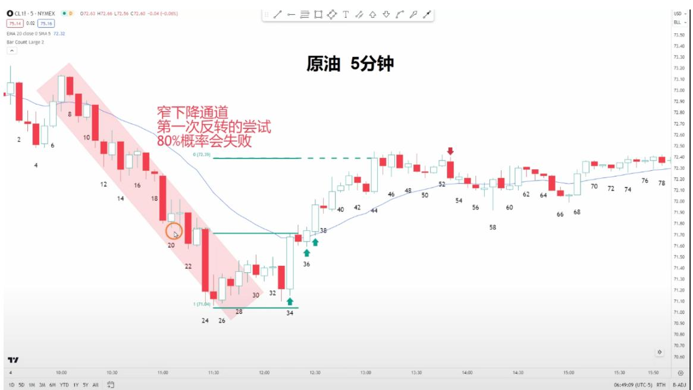  
窄幅下降通道，紧贴着趋势线运行。每次反弹幅度和持续时间都很短。

## 窄通道=强趋势

尽管有几次突破了通道上边，但是窄通道的第一次尝试反转 80%概率会失败，因此先不要介入。尽管连续两根阳线。等待回测后有更好的信号 k线。

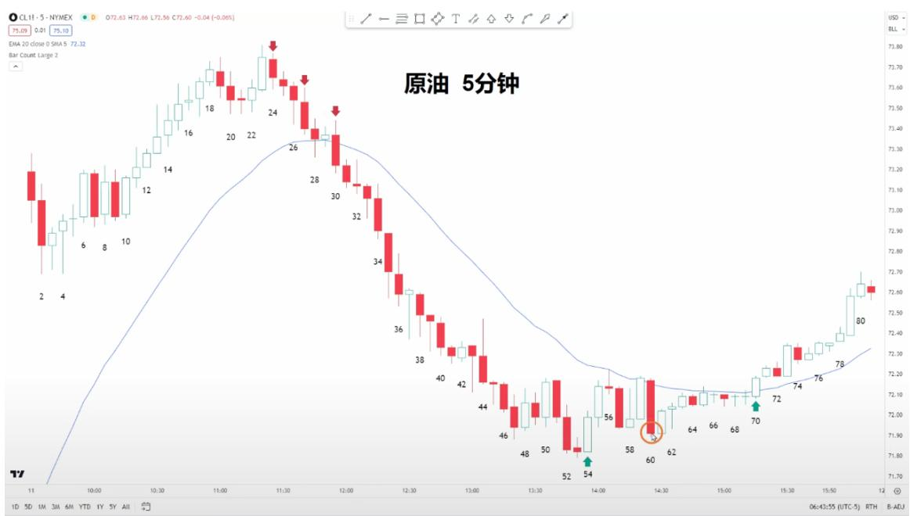

更加强劲的下降趋势，反转也更加艰难。底部可以看作头肩底。

可能在50号k线处通道上边被突破了。但是第一次突破成功概率很低，所以先不要入场。

强趋势下需要好的信号 k 线；54

或者等形态走完入场；70

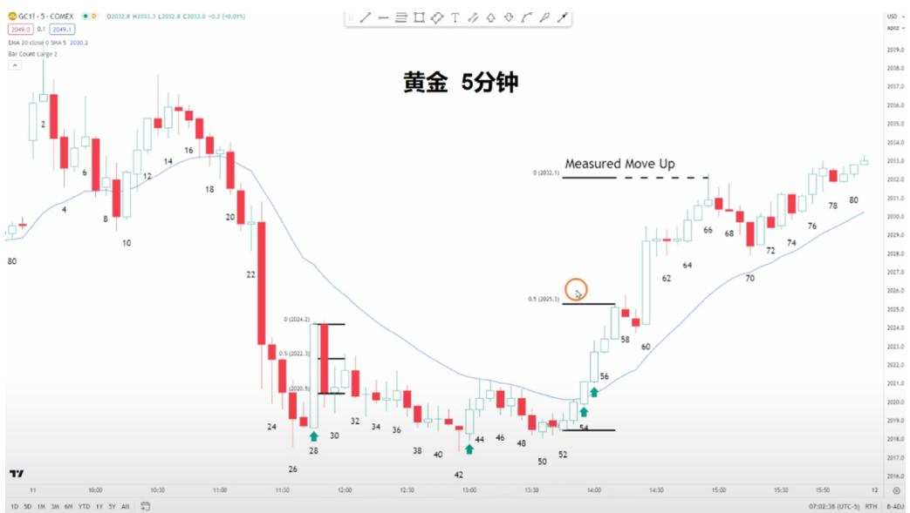

跌下来后，28是一根很大的大阳线，且几乎收在最高。但是相较于前面的强下降趋势来说还是不够的。因此在此处更多人选择卖出，价格继续向下。

如果此处买入，最好用小仓位，因为需要大止损。后续如果在29收盘补仓，市场在31号k线给了一次 50%的机会，可以成本价出局。

虽然这根完美阳线后续继续下跌，但是这里作为入场点是非常合理的。这种合理的入场点，后续市场大概率会给机会，让你加仓打平/小赚离场的。

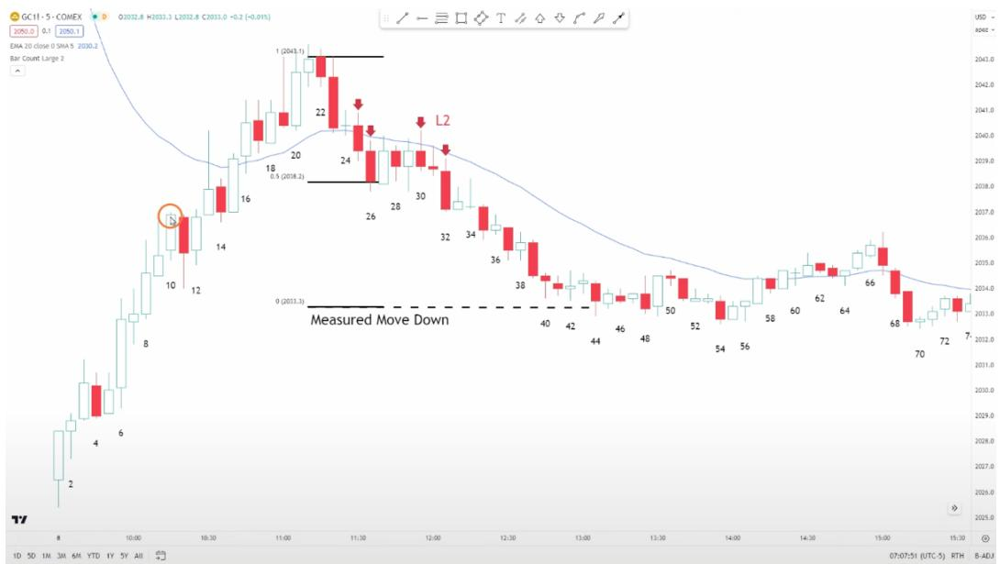

前期强劲的上涨窄通道。10号k线处渐渐开始走弱，但总的来说还是一个上涨窄通道，第一次被反转的概率还是不大。看到22就去做空不太明智。但是有时候一些小概率的时候，会发生所谓的V形反转的结构。（无结构，直接反转。）

这时候看到 25，26 这种连续阴线收在 EMA20 下方，不要期待过多反弹，可以追空，

## 信号k线&入场（3）

反转需要好的背景+好的信号 k线。

如果背景和信号 k 线都不好如何交易？

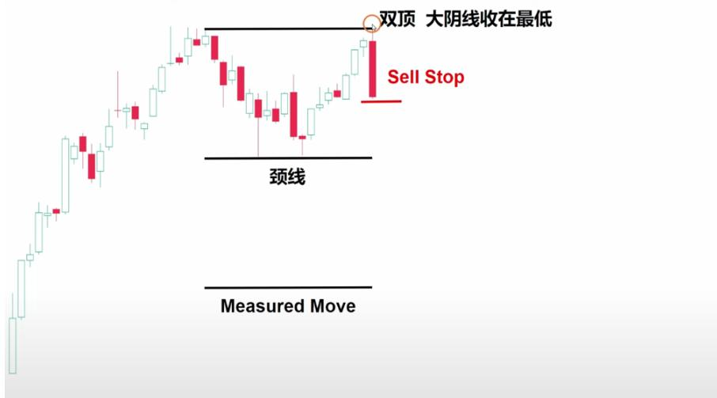

左边非常强的上涨趋势。市场具有惯性，80%反转都会失败。因此前期虽然几次尝试反转，但都延续了多头趋势。因此做反转需要看到连续的阴线收在低处。顶部的第一波下跌就很不好，跟随很差，跌跌涨涨，且很多阴线有较长下影线。因此判断在其下方更多人选择买入而非卖出。很多多头会逢低买，赌这段上涨趋势的二段上涨，至少到前高位置。

像这种跟随很差的下跌走势，更大概率只是震荡区间中的一段，而不是一个大的下降趋势中的一段。但是当再次上涨至前高处时，情况发生了改变。收盘未能收在前高上方，且在前高处出现了体积巨大且收在最低的信号k线。因此在它下方挂突破单做空。盈亏比很好，双顶形态如果能够顺利跌破颈线，后期可以期待走出等距行情。

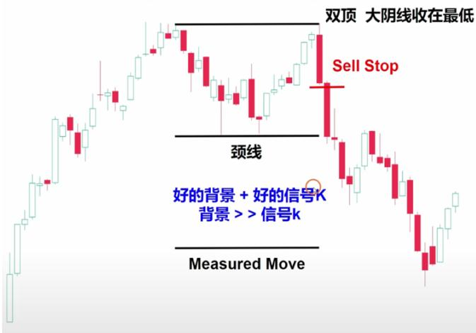

后续跌破颈线后出现多头吞噬线，但前面连续阴线，大概率只是反弹，非反转。（回踩颈线）。

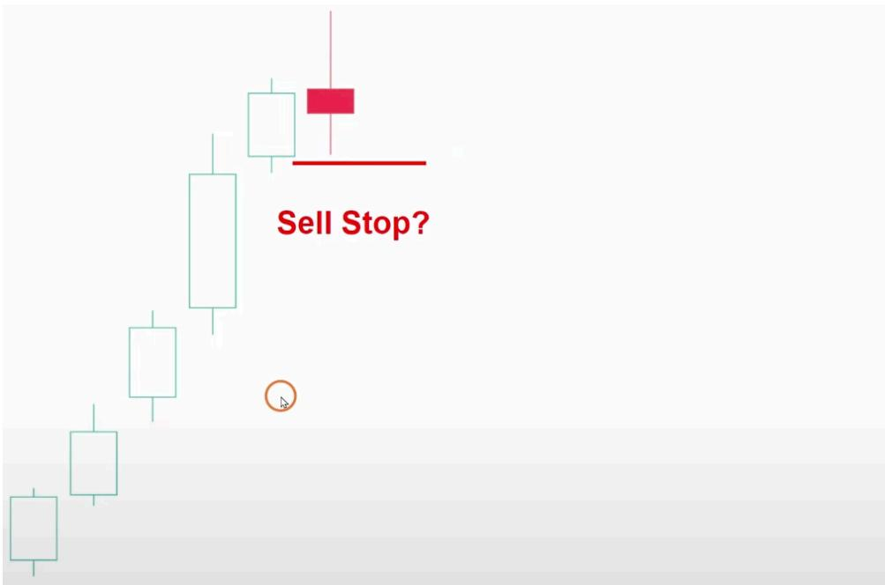  
从背景+信号 k 线双角度分析是否可以做空  
背景；连续阳线且收在高位，强势上涨趋势。上涨概率80%。

信号 k线；实体很小影线很长，几乎是一个十字星，且未能收在低位。

糟糕背景+糟糕信号 k线=胜率低。

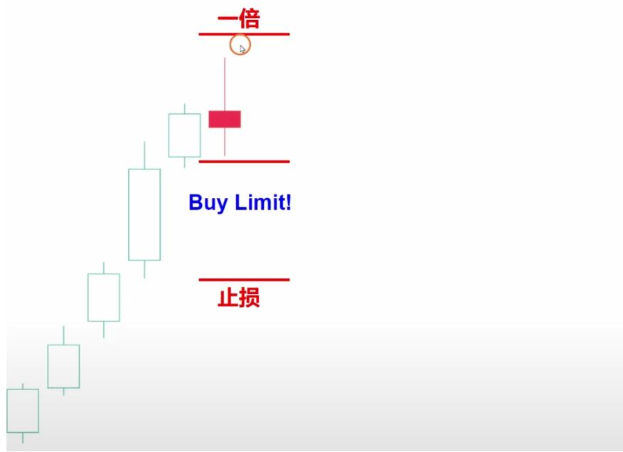  
解决办法；下方挂买单。赌空头失败。  
缺点；盈亏比差。

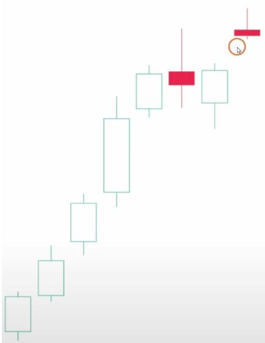

顶部这根k线可能会被当做倒T形线。虽然是一个做空信号，但是它的实体部分很小，从信号 k 线角度来讲，是一个很差的信号 k 线。且当前处于强上涨趋势中，做空理由很不理想。

因此在它的下方更多人选择买入而非卖出。特别是这根k 线属于跳空k线，在它的下方产生了价格缺口。很多人会在缺口下边（前一根阳线极值处）挂单买入。

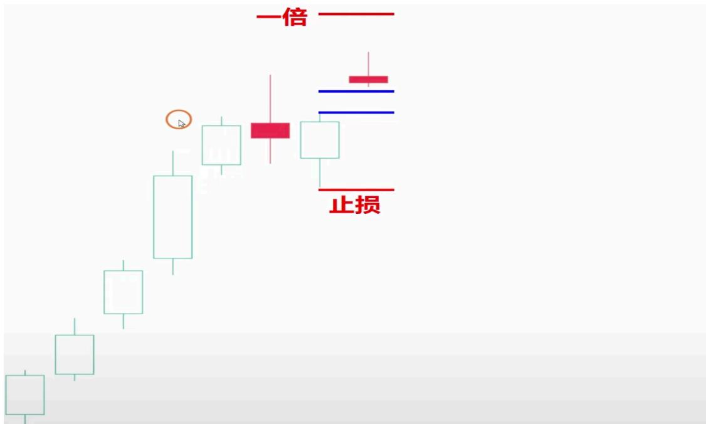

和前面一样因为涨了很多，尽管胜率会很高，但是盈亏比会很差。

解决方法；由于是上涨趋势。高点和低点都不断在抬高， 旦低点被跌破，那么这个上涨趋势可能不再成立。可能变成一个震荡区间，甚至被完全反转。止损如图。

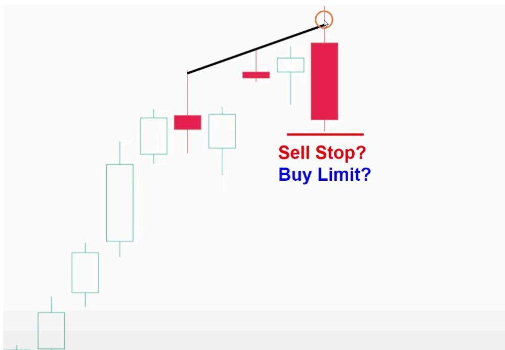

当看到最新一根阴线时，情况发生了改变。前面好像走完了一波三推。且这根k 线体积巨大，同时吞噬了前面两根 k 线，且收在几乎最低，是一个良好的信号 k 线。

背景方面；好像走了一个三推楔形反转，但是左边趋势很强，显得信号k线不是特别完美。

此时入场，即使后续继续下跌回调，无法确定能跌到什么位置。

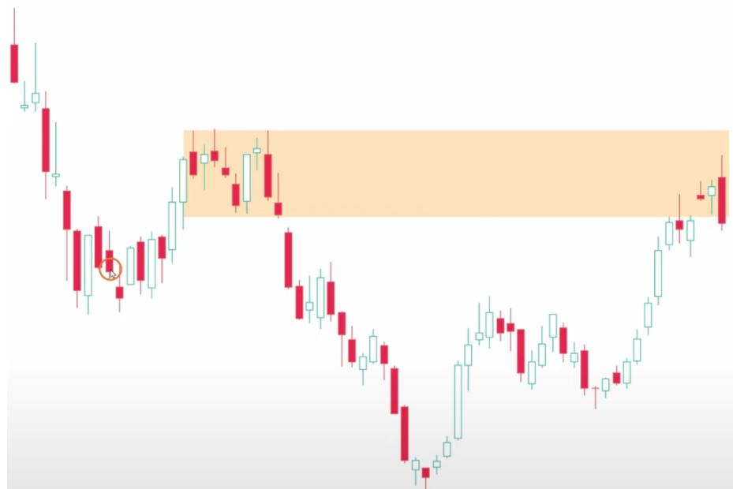

此时参考这段行情前面的走势；好像处在大跌下来后，二段行情陷阱处，且处在前方压力位区间。压力位出现这种大阴线，多单持仓先清仓。

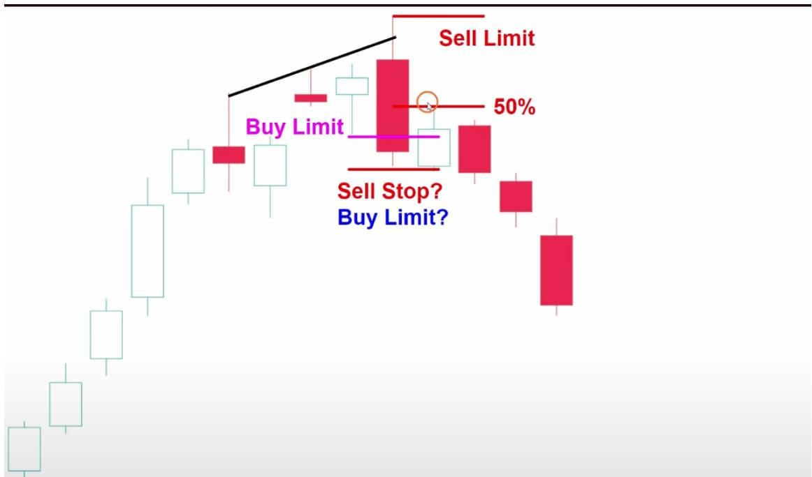  
底部挂突破卖单；阴线顶部挂卖单；阴线底部挂卖单。  
阴线顶部挂卖单；盈亏比极高，但是未能触发。

## 数 k 线

## 回调&数k线（1）顺势交易

结合信号k线配合使用，主要依靠信号k线判断。

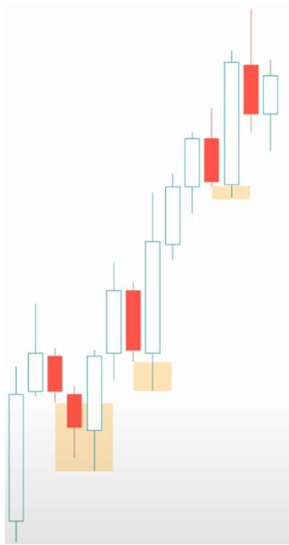

上涨趋势：高低点不断抬高

上涨中的回调：出现了更低的低点跌破前一根k线的最低点

上涨趋势高低点都不断抬高。当出现一根 k 线跌破了前一根 k 线的低点时，就是一次回调。

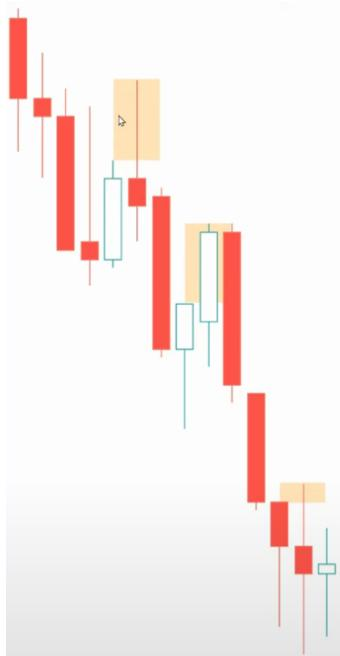

下跌趋势：高低点不断降低

下跌中的回调（反弹）：出现了更高的高点突破前一根k线的最高点

下跌趋势高低点都不断降低。当出现一根k线突破了前期一根 k线的高点时，就是一次反弹。

上涨趋势中的长影线，小阴线，十字星=隐藏的回调。  
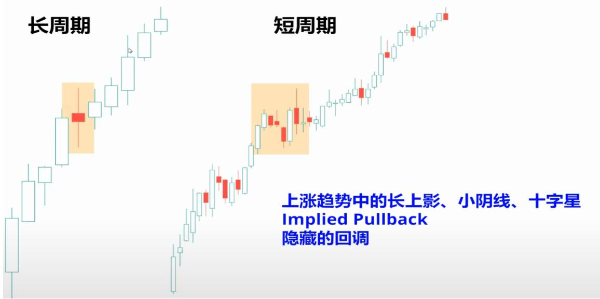

大周期来看是一段强上涨趋势，所有高低点都在抬高，没有任何一根k线的低点是比前一根k线低点低的。就大周期而言这段走势是没有回调的。

但是，如果切换到小周期来看，大周期的十字星k线处在小周期是有一次回调的。包括前面长下影线的阳线处，在小周期来看是有一段回调的。以及前一根k 线的上影线部分，在小周期来看也是发生过一次回调。

多头会在这类k线的收盘处买入，赌这只是一次回调，期待后续趋势继续延续。

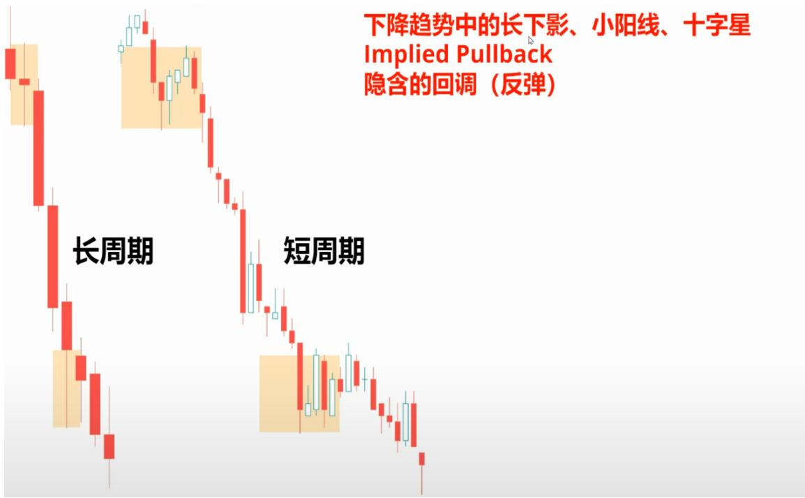  
下跌趋势同理。

回调为什么如此重要？

它给交易者提供了高胜率的入场机会。

一个强劲趋势，当它出现回调/反弹时，此时入场盈亏比很好，胜率很高。  
顺大趋势，逆小回调。

## 深度反弹；

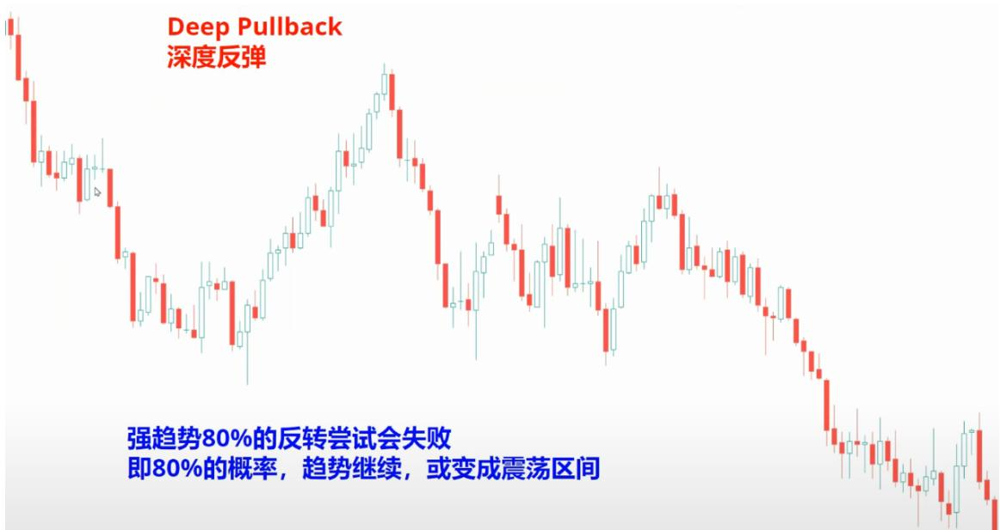  
强趋势的反转80%概率都会失败。

前期一波强势下跌，尽管出现了强势的反弹（上涨窄通道），也未能超过下跌趋势的起跌点。因此这也仅仅是一次反弹而非反转。

这种大跌大涨大跌大涨，符合震荡区间的特征，后续果然经历了一段横盘震荡后才继续下跌。

机构交易者无论在哪做空，通常会将止损放在下跌起点的上方。随后在持仓时不断的加仓平摊成本，后续行情无论是横盘还是回到原点，都可以保证不亏，甚至小赚。

但是对于普通交易员而言，做空后在第一波低点位置，看到那根有长下影线的阳线时，是一个比较一般的多头信号 k 线，此时最好离场。后续再找机会入场更加稳妥。

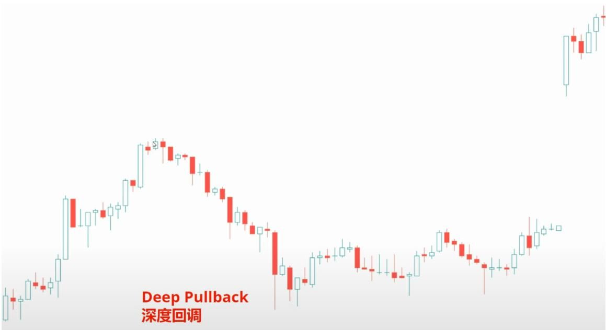

左边一段强势上涨趋势，后续的下跌虽然很猛，一度快要回到上涨起点的位置，但是最终也未能跌破上涨起点。因此只是一次回调而非反转。

机构交易者无论在哪做多，通常会将止损放在上涨起点的下方。随后在持仓时不断的加仓平摊成本，后续行情无论是横盘还是回到原点，都可以保证不亏，甚至小赚。

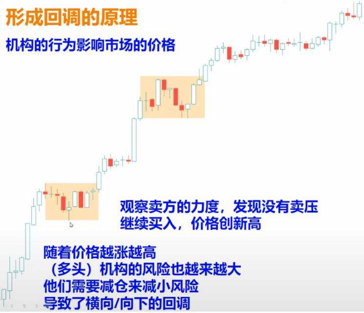

对拥有大资金的机构来说，他们的止损往往放在上涨趋势起涨点的下方。当市场越涨越高，对机构而言所承担的风险也是越来越大的，因为距离起涨点下方越来越远。

机构的风险管控；随着价格越涨越高，机构风险也越来越大。通过减仓来减小风险，引发市场横向/向下的回调。

减仓的同时，机构还会观察卖方的力度，看是否有空头跟进。当发现没有做空力量时，他们会选择继续买入。

直到价格创新高。创新高后，他们会将止损从起涨点上移至上一个回调波段的最低点下方位置。上移后风险也减少了。继续持有至又上涨了很多后，同样为了风险管理，再次减仓，同时继续观察空头力量，如果还是很弱，他们还是会选择继续买入，同时上移止损。直到未来某个位置，当发现空头力量很强劲时，就会卖出平仓。

## 多头卖出平仓+强势空头卖出=反转。

## 50%回调重要性；

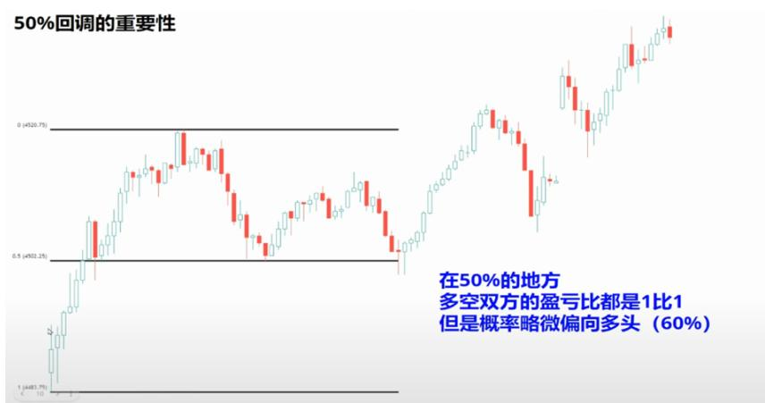

这段强势的多头趋势，为什么回调到 50%位置停住了？多头；此时做多期待测试前高。空头；此时做空期待回到起点。双方盈亏比都是 1：1。

但是由于前面是强势上涨趋势，概率略微偏向多头（60%）。  
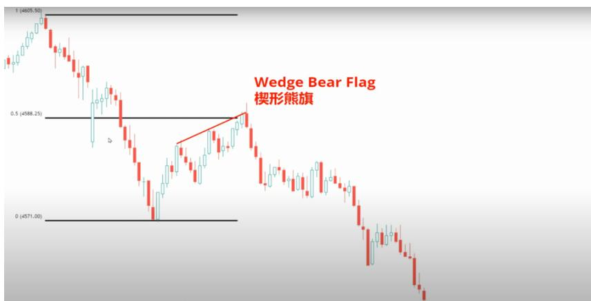  
下降趋势同理。

## 数 k 线；

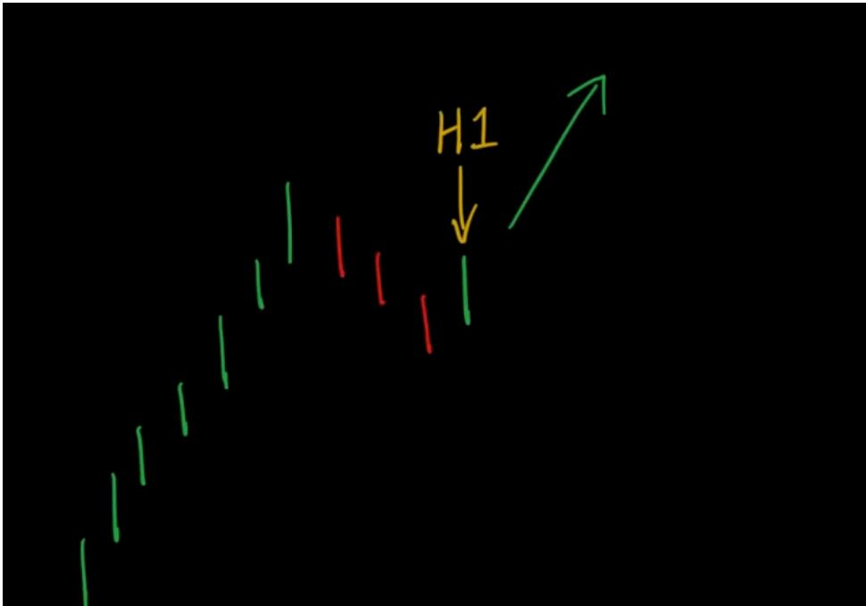

上涨趋势高低点不断抬高。当出现一根低点低于前一根k 线低点的k线时，回调开始。回调过程中当第一次出现一根高点高于前一根 k 线高点的 k 线时，这个就是高 1。

高 1入场理由；由于上涨趋势高点不断抬高，此处高点再次抬高，多军入场期待后续行情延续。


但有时行情回调并不是只有一段，像上图这种（两段式回调），高1失败了，回调继续，行情继续下跌。当再次出现一根最高点高于前一根 k线最高点的k线时，这个就是高 2。


值得注意的是，如图高 1处，如果下一根还是一根阳线，且最高点高于高 1最高点，这根 k 线也不是高 2。高 2 要等高 1 失败，回调继续后重新数。高 1 处无论有几根阳线，高 2始终还是图中的高2。


有时可能两段式回调后还不够，会继续回调，从而出现高 3。

高 3 实际上相当于三段式的楔形牛旗。


左边连续四根大阳线，且收在很高，强势突破。随后进入窄通道。且这段涨势长期运行在EMA20的上方，属于强势上涨趋势。强势上涨趋势下，首次的反转尝试 80%概率会失败。因此，虽然顶部出现吞噬k线（低点降低），但是首次的尝试大概率失败，当作回调处理。

大资金机构交易者将止损放在上涨起点下方，或通道起点下方。后续不断买入，可以在回调开始后的每一根 k 线上方挂突破单，前面几次持续下跌未能成交，直到高 1 处首次成交。后续高 2，高 3 操作同理。

个人投资者无法接受这么大的止损，且三次买入点差距不大，起不到平摊均价的效果。

因此最好在好的信号 k 线上方做多。


高 1 后一根是个大阳线，好的信号 k 线，可以在上方挂突破单，未能成交。

高 2 本身也是个好的信号 k 线，上方突破单成功成交。

高 3本身也是个好的信号 k线，且走出了3推楔形牛旗形态，此处挂突破单更加稳健。

高 1，，高2，高3何时使用？  


左边强势上涨趋势，中间只有一根阴线，且是一根很小的十字星。在这种超级强势的趋势中，市场上的交易员迫不及待想在回调时买入。这种时候选择高 1入场。

一般情况下不会使用高 1 入场，因为回调总是有二段/三段式回调。只有在超级强的趋势下才会选择高1买入。

属于 always in long 行情，只做多不做空。

市价买入；突破买入；阳线收线买入；阴线收线买入。找各种理由买入。


左边连续三根阳线收在一半以上，且第一根阳线巨大。后面开始回调后，高1处，前一根k线本身是一个不错的做多信号k线。两者结合入场。

止损在回调最低点下方，止盈期待1:1盈亏比。

上涨趋势，回调出现高 1，上影线太长，信号 k 线不好，所以不做。继续等出现了高2，且前方是一个非常好的信号k线。两者结合入场更稳健。


  
有些回调会回调的比较多甚至可能出现高 3，高 4。

这种情况走了一个类似下降通道的结构，前面几次出现高点都未能延续多头趋势，这时候最好等待有强势阳线突破这条下降通道后再考虑入场。

机构交易者可以每次出现高点突破就买入。但是对于散户来讲，尝试一两次都未能延续原趋势的话，最好空仓等待更好的机会。


下降趋势中高低点都在不断降低。当出现一根高点高于前一根 k 线高点的 k 线时，反弹开始。反弹开始后，第一次有一根k线的最低点突破前一根 k线最低点时，这个就是低 1。


同理，如果低 1 出现后未能延续空头趋势，而是继续反弹的话；第二次有一根k 线的最低点突破前一根 k 线最低点时，这个就是低 2。低 3 同理。

和高 3 同理，低 3 可以看作是一个楔形熊旗的反转结构。


这是一个双顶结构。一根巨大阴线收在底部，大概率会有一波二段下跌。后面两根阳线出现了反弹。反弹后的下一根阴线突破了它的低点，这里是个低1入场点。

目标位可以期待双顶的等距行情。

创新低后重新记数。  


低 1 处不要轻易介入，即使入场也要轻仓大止损，观察后续反弹力度再做判断。

低 2处是一个很好的做空信号，前一根阴线曾经尝试向上突破但失败了。紧接着出现了低2。


前面两根阴线剧烈下跌，短短五分钟内接近1%。紧接着出现了一根比较强的阳线，但它大概率只是一波反弹而非反转。

后面出现了低1，在此背景下考虑到前面这个大阳线的存在最好不要入场。

低 1 前一根 k 线和后一根 k 线组成了一个小双顶，且后一根 k 线本身也是一个非常好的空头信号k 线。因此在它的下方一点处，既是低 2入场点，也是好的信号 k线的入场点。结合使用。

继续下跌，反弹幅度很小，走了一波下降窄通道。永远卖空。

底部的低1处（跌破前低后重新数的低1），前面是一根十字星，不是很好的空头信号 k 线。后续出现了低 1。在低 1 的底部下方挂突破单。把低 1 当作入场信号更加稳妥。


前面五根连续阴线，且其中两根体积很大收在低位。后面虽然走了连续的阳线，但是体积都不是很大，大概率只是反弹而不是反转

紧接着出现了不错的做空信号 k 线，一度尝试向上突破，失败后收在低位。紧接着出现了低2。

  
下降趋势创新低后重新开始数。

这里有连续五个低 1。说明多头反弹只有一下，多头无力=强下降趋势。


下降趋势很强，但后期的反弹力度也很强，直到低5出现后原趋势才继续延续。

在高 1/高2处尝试失败后，发现这是上涨通道。此时空仓等待，至少等这个通道被突破后再找机会入场比较好。


回调和反转的定义；


前面是强上涨趋势，这段下跌认为是回调而不是反转。尤其在EMA20附近得到了支撑又收了上来。

出现了很不错的高1。

开仓后立刻马上出现了一根向下的吞噬线。这时候多头都被套住了，是一个多头陷阱，赶紧离场。

后面连续几根阴线都收在 EMA20 下方，这时候可能就不是回调了，而是行情发生了反转。

好的入场点，入场后立刻失败可能是个陷阱。

  
前面强上涨趋势，回调后很久没出现高1，中途出了一次高 1但也马上失败了。  
不要看到阳线就去买，即使要买也要在上方挂突破单。

  
一开始当作反弹处理，出现了低 1 但是并不完美，很快就失败了。

  
三推楔形。

低 1，低 2，低 3 全都失败了。

这种情况下可能会反向去到等距目标位。

失败的楔形会往反方向走很远。

## 回调&数k线（2）逆势交易

结合数k线分析逆势交易者何时离场。


这波上涨太过强势，尤其25和27号大阳线。因此当发生回调后，多头认为至少还会有一段上涨。回调后如何买入？结合数k线，30号 k线是回调后第一次高点超过前一根k线高点的 k线。因此在29号上方挂单买入，30号k线出现高 1成功触发。但是就 29号k线而言，并不是一个好的做多 k线。实体很大的阴线收在下方。这就导致在其上方挂单买入的人很少。

高 1、高2和低1、低 2，并不在乎前一根k线是否完美，是非常纯粹的按照趋势定义的。

图中的高1是个成功的高 1，后续没有k线跌破其低点位置。只不过由于前一根 k线过于糟糕，在其上方挂单的人很少。

正因如此，一些糟糕的低 1/高 1 反而是逆势交易者喜欢开仓的入场点。

像这种糟糕的信号k 线，不仅买入人数很少，反而还会有部分空头在其上方挂单卖出，逢高做空。


当市场在回调后，第一次尝试恢复趋势时，反方向力量还会忍受一下。反方向力量会理解为尽管多头力量很强，但市场依旧在前期关键高点的下方，有可能下降趋势是依然成立的，只不过变成一个宽通道或者震荡区间。因此在空头视角里可以当作一个双顶。因此在33号k线下方挂单期待下一根出现低 2。后续成功触发。


但是他们刚开单入场后，市场立刻向上反弹。反而变成了一个收在高位的阳线。此处是市场第二次尝试延续上涨趋势。也就是说，对于逆势空头而言这是市场第二次在反对他们。当市场第二次反对时，这是来自市场的警告。应当先离场观望。

空头该如何离场？

1，34 号 k 线上方。如果有第二次向上抬高的话应当离场。

2，将止损放在32号 k线上方，也就是整个双顶结构的上方。多头也知道空头可能在此买入止损。因此他们可能也会在此挂单买入。多空双方都在买，同时推动市场向上。35 号 k 线属于空头放弃 k 线。


空头希望跌破颈线后达到等距行情。市场未能按照预期，反而因此达到反向的等距行情。


震荡区间内信号 k 线失去意义。  
  
开盘的第一个趋势不管有多强 80%概率会有小反转，50%概率会有大反转。

因为开盘的第一个趋势往往是去测试前期的支撑或阻力的位置。然后在支撑阻力位处，市场共同决定它是突破还是反转。


震荡区间内没有趋势，一定要说趋势的话那就是惯性。震荡区间内的顺势交易其实是押注所有的突破都会失败，趋势继续持续下去。因此在区间内做突破的人，反而成了逆势交易者。

认为突破能成功的交易者在下方第一次失败了，他们继续尝试（允许市场反对一次）。第二次继续尝试（14号处），很快被15号k线吞噬，这里也是一个双k线反转。当第二次尝试失败后，空头会在15号k线上方买入离场。因此这个位置对于多头来讲也很关键。


如果开盘的第一个趋势幅度非常大非常强，那么哪怕它被完全反转了也很难超过起跌点太多。因此当看到 29号这种k线时一定要小心。它是这段上涨趋势内最大的阳线。且处于开盘下跌趋势的起跌点附近。当趋势持续一段时间后，出现巨大的k线，小心抢购高潮。哪怕判断后续行情继续上破也要等看到好的跟随后再进。


这种抢购高潮的收盘价到前期k线的高点处出现了缺口。这种缺口非常有可能会被回补。


40 号k线处实体太小，下影线也过长，不太理想。41号 k线就很完美，在其下方做空就很合理。止损在最高点上方。一倍盈亏比处，市场出现了反弹，二倍盈亏比处，市场也出现了反弹。

反弹是空头止盈引起的。

市场没有巧合。

## 缺口


## 缺口；价格之间不重叠的部分就是缺口。

最高/最低价（影线）缺口；收盘价（实体）缺口；趋势线/EMA 缺口。

缺口代表不重叠。不重叠代表当前趋势较强。


宽通道为例，重叠度很高，意味着多空双方都赚钱，宽通道是弱趋势。


连续三根阳线向上突破制造缺口。

强势突破，空头持续加仓无法解套。空头恐慌买入止损+多头买入=进一步推动价格上涨。


沿着均线涨了一天，每次回调至均线处就有大量人买入。多头连续创造缺口，空头无力回补。即使怕追高不做多也不要去开空。


实体部分缺口蜡烛图看不出来的话可以切换到折线型图。  


跳空；收盘后买卖还在继续只是不显示出来而已。买卖双方夜盘共同推动导致新开盘价格相较于前一天收盘向上或向下跳开。

突破型缺口；代表突破的强劲。再加上有跳空缺口，后续可以期待继续上涨。

测量型缺口；行情继续上涨再次出现跳空时，将这个缺口的中心部分到底部的距离，向上翻一倍当作第一目标位。

测量型/竭尽型缺口；顶部高开两次都被回踩了，体现了行情的衰竭。也可能是测量型缺口。但是后面即便再创新高可能也要转入震荡区间。

  
缺口中间当起点，向下低点距离向上做目标位。两个低点都可使用。

MM 目标位不是唯一的。  


## 测量型缺口做目标位。


## 缺口（2）


前面三推楔形底。开始向上反转时连续的跳空缺口，这种属于突破型缺口表示反转的力度很大。到了 0.5位置处出现了测量型缺口。可以以这个缺口为中点向上翻一倍作为目标位。后续目标位处果然停止了突破变为交易区间。最顶部已经涨了这么多，出现的缺口更大可能是竭尽型缺口。这种缺口会很快的被回补掉。


长时间的震荡区间后，第二天直接大幅度跳空高开，刚好打到震荡区间的等距目标位。第1根k线下影线很长收在一半左右位置，有可能是多头止盈所引起的。暂时看不到有空头激进入场。

紧接着第2根k线收在最低，可以在收盘进行做空。这里其实并没有很强劲，尽管两根连续阴线，但是它们之间的重叠过多。且它们的体积也并没有很大。

此处入场原因；开盘连续两根阴线，至少目前看不出有多头愿意去买入。且由于前两根k线重叠度太高，即便后续不继续下跌，大概率也会走一个震荡区间。


第 3根阴线小十字星。不是很理想。尽管还是下降趋势，但是这段有重叠、有停顿，表明了下降趋势并不强劲。


4 号k线继续下跌没有问题。

5 号k线又是一根十字星。此时开始数1-反弹2-反弹，小心接下来出现三推。  
这样的趋势不够强劲小心被反转或进入震荡区间。

潜在三推出现时；顺势方考虑止盈，逆势方准备入场做反转。


止盈后在这根大阴线收盘左侧买入做多。

理由；开盘的这段下跌趋势很弱，看得出来没有空头愿意大量做空，大概率只是一次回调。且走出了一个三推楔形底。在这里头仓进去剥头皮策略进行交易。后期也可以依据信号k线或均线进行加仓。


紧接着出现了一根大阳线。值得注意的是7号k线跌破了前期低点（4号k线最低点），制造了价格缺口。如果是一个良好的下跌趋势，这个缺口不会被马上补掉，但是 8 号 k 线这根阳线立刻回补了这个缺口。

对于绝大多数交易者而言，最好还是在看到 8 号 k 线后再进行入场更为稳妥。


后面连续阳线向上。尽管不是特别强但是继续持有没有问题。


后续如果提前离场了，看到 14号k线特别强劲且收盘在 1号k线上方，可以市价追涨拿到 15 号 k 线收盘，做剥头皮交易。


## 15 号 k 线可以追吗？

这段行情属于永远做多行情。追进去没有什么问题。但是这里的 k 线幅度越来越大，有可能会是抢购高潮。

且这段上涨行情几乎没有回补过实体型缺口。上涨这么久到15号k线处，与1号开盘k线产生了很大的实体型缺口。这个可能是竭尽型缺口。

不建议入场做多，除非可以接受初始止损很远以及逢低加仓。


如果收盘后直接追涨，补仓点放在这根 k 线开盘位置。后一根 k 线成功加仓，且收盘还在 50%位置上方一点。收盘直接离场可能还有一定的盈利。

单就最新的阴线而言，回调幅度很深甚至一度吞噬了前一根阳线。因此判断后续上涨力度不会很强。


紧接着的又一根阴线，影线部分与开盘价高点已经有了重叠。代表在前高位置左侧入场做空的已经打平。如果逢高加仓甚至已经小赚。实体部分虽然没有完全回补但相差也很小。

看到这种情况，后续可能变成震荡区间，或者形成双顶，楔形顶被反转。

当前暂时不要去空。下影线长度还是比较长的，且前期上涨趋势比较强，回调后可能会有交易者逢低做多。

或者说这种位置做多做空都不会亏钱。只要能逢高/逢低加仓都可以回本甚至小赚。


如果刚才不想逢高追多的可以等待回调。参考50%位置，或均线附近。同时这段回调还是个ABC式回调，最新k线又是一根高2信号k 线。止损在均线下方。止盈看前高。

目前来看在此处开单胜率还是很高的。因为前期上涨趋势还是很强的。这段下跌目前来看也只是一段回调。

  
后续市场演变为比较宽的上涨通道。在均线上方运行。

非常强的趋势大概率都会有一个二段行情。这里的二段上涨因为是宽通道，所以很弱。


后面行情形成了一个双顶。刚创新高就立刻大阴线打下来，且这根阴线收在均线下方。这是今天第一次有一根k线收在均线下方。这根也是双顶反转的信号k 线。

后面一根十字星和一根大阴线。这三根 k 线的收盘价都在均线下方。连续的阴线收在均线下方市场可能进入了永远做空行情。

判断行情是否被反转；看实体型缺口是否被回补；看后期是否有好的跟随。


永远做空行情下即使有反弹也可以期待走出第二段行情。48 号 k 线尝试反转但并未能收在均线上方。同时还产生了实体型缺口，并且恰好在 50%位置处。在 50%处挂单做空；在 48 下方挂突破单做空；49 收盘市价做空都是可以的。50 收在最低。永远做空。下降通道。


空头目标位是下方跳空缺口附近。左侧做多止损过大。

永远做空。


下方又产生了实体型缺口。50号大阴线下来可能有空头选择止盈。但观察后续发现始终没有阳线收在最高。多头无力。

因此当再次看到做空信号时可以继续跟随做空。

继续下跌后，底部出现两根大阳线。但是一般强趋势的第一次尝试反转都会失败。

如果要做多必须连续的阳线特别的强，收在最高，收在均线上方。

或者再次下跌形成双底之类的形态。

开盘第一段下降趋势和当前下跌趋势的区别；

当前下跌；连续五根阴线，反弹一下；连续两根大阴线，反弹一下；连续五根k 线其中四根阴线再反弹一下。

开盘后第一段下跌；几乎跌一下就反弹一下。


后面反弹至均线处失败再次下跌。下跌后二次尝试反弹依旧失败。68号k线很不错的信号 k 线。下方做空至少看前低，后面一根 k 线就达到止盈位。

## 65 号同样既是50%处又是均线处。

60 号开始的反弹幅度还算可以。因此可能会有人在这个位置挂单做多。因此后市存在变为震荡区间的可能。


后续反弹后碰到均线再次下跌。这个通道就是贴着均线运行的。

均线的重要性；判断趋势最简单的方法就是均线。


## 缺口（3）

缺口和盈亏比  


40%胜率+至少两倍盈亏比+其他时候小亏小赚或打平=稳定盈利

假设 5 万美金本金。每次冒 500 美金风险，即账户的 1%。

每周 10 笔交易。

目标；争取两倍盈利；赚 1000 美金。

  
开盘的第一个趋势不管看上去有多强，80%概率有小反转，50%概率有大反转。

图中 7号k线是一根还不错的反转k线，后面紧跟着阳线收在一半以上。收盘后买入期待有一个大反转，至少也能有一个小反转。后续很可惜多头突破均线失败且一直有较深的回调。当看到14号k线又是一根阴线且收在低位时，在其下方挂单后续成功离场。本单小赚大约 200 美金。


连续九根阳线的强上涨趋势，且大部分收在一半以上甚至最高。

强趋势后面有一段回调，但并未成功跌破均线。后续63号 k线又是一个大阳线收在高位。同时还是高1。在这根k线收盘或上方买入做多期待趋势继续延续。但是后续很遗憾突破失败。本单亏损 500 美金。


大楔形套小楔形，且 74 号 k 线本身是一根完美的信号 k 线。成功拿到两倍目标位。


假设一周内十笔交易有六笔小赚小亏或打平。四笔达到两倍目标位，赚 1000 美金。

一周总盈利 4000 美金左右，约账户本金的 8%左右。

即便只有两笔达到两倍目标位，其他八笔小赚小亏或打平。总盈利也有两千美金左右约为账户本金的4%左右。

控制亏损是前提，止损的重要性。  


开盘第一根 k 线有一个跳空低开，但 k 线没有收在最低而是一半以上的位置。  
至少第一根k线来看下降力度还不够强。


第二根虽然是一根不错的阴线，但未能收在 1 号 k 线最低点下方。

开盘连续两根阳线，其中一根体积比较大且收在比较低的位置的话，有一定概率是开盘第一个趋势的开始。

第一根 k 线出现后，有 20%概率当天的最高/最低已经出现一个了。

2 号k线收盘处做空，其实就是在赌1号k线最高点是今天行情的最高点。行情还会继续向下进行。

紧接着3号k线是小十字星并且有一点点阳线的体积。还是没能收在开盘价最低点下方，依然是一个小瑕疵。

但是目前做空逻辑还是成立的，因为 k 线一直在均线下方运行。


4 号k线依然是一根小十字星。此时对于空头来说没必要离场。开盘的6-12根k 线大部分都是这样的震荡区间。所以最好还是观望为主。如果要跌的话，等反弹到均线附近出现好的形态再去做空更为合适。


5 号 k 线依然是一个十字星。可以看到每次向上突破其实都是失败的。


6 号 k 线同理。


五分钟来看是连续的小阳线。放到更小级别一分钟来看明显是一个宽通道。

宽通道 75%概率会被反向突破去测试通道起点。

因此在这时做空的空头完全没有必要去担心。没有大的阳线收在高位。初始止损或将止损放在均线上方，等多头完全突破再止损也可以。


继续小阳线。


8 是一根小阴线收在一半以下位置。作为做空信号k线来看比较一般。但是结合背景可以看作是一个双顶。虽然连续五根阳线但力度都很一般，且没能收在高位。

当第六根 k 线收盘时 50%概率今天的最高/最低点已经出现了一个了。  
因此在 8 号位置去做空，赌今天是一个大的下降趋势。高点为开盘价。


在 8 的下方挂突破单。止损在 8 号 k 线极值上方或开盘价上方。至少拿一个二倍盈亏比。


9 号 k 线十字星，没有立刻下跌。在其下方好像并没有很多人买入。

10 号 k 线非常不错。大阴线收在几乎最低。

此时空头肯定希望连续的阴线。但更希望的是一根阴线收盘在前期最低点的下方。


因为这十根k线走了一个震荡区间。期待能够成功被突破。后续可以看到 MM目标位处。

多头同理希望收盘在今天最高点上方。


这根 k 线（最新一根）运行时在下方非常纠结。碰到一倍目标位后立刻反弹。后续一直维持十字星状态。距离收盘一分钟内突然拉高收在高位。空头很不愿意看到这种。


因为这是第 11 根 k 线。五分钟周期的第 12 根 k 线对应着一小时 k 线的收盘。  
空头希望一小时可以收盘在最低。多头反之。


紧接着第十二根k线，开盘后直接向上拉伸。说明十一号 k线的运行被部分交易者看到了。其中的空头交易者可能会离场。多头也可能会去买入。

同时这个位置也是低开后很标准的双底。

11 又是完美的入场信号 k线。


13 又是一根阳线收在高位。


14 连续阳线收在高位尝试突破号 k 线开盘价的最高点。


## 15 成功突破。

如果当作双底处理。按照刚才说的在11号k线上方挂突破单。止损放在3号k线下方。

15 号k线刚好打到两倍目标位后出现了回调。

这里表明了很多交易者在此技术性止盈。

这个位置其实可以止盈一半甚至不止盈。因为开盘开始一直是震荡区间。这根k 线属于是对区间的突破。后面60%概率去到区间的MM位。

但是 15号k线因为有很长的上影线，所以不是一个好的突破 k线。这根k线也是首次收在均线上方的 k线。看后期跟随如何。


紧接着又是一根阳线收在高位。唯一的遗憾是这根k线下影线碰到了均线。没有制造缺口。如果开盘后直接上涨与均线之间产生缺口的话会更加完美。

  
17 号；小十字星没什么问题。

重点观察 18 号 k 线；作为做空信号是非常好的，体积够大且几乎收在低位。

特别是第18根k线，也就是第 90分钟的时候，市场特别容易出现突破或反转。

因此如果在 18 号 k 线下方挂突破单做空也是可以理解的，尽管胜率不高。

左边连续四根阳线很强的上涨趋势至少会有一个小的第二段上涨。

就目前走势来看还不能 100%确定震荡区间已经被完全突破了。如果后续继续下跌又回到震荡区间则震荡可能继续持续。当作震荡区间来看的话，在区间内第一次反转则很容易成功。

同时 12 号 k 线最高点和 15 号 k 线最低点的缺口还未能被回补。

因为如果只看的12号 k线的话这里明显是一个震荡区间。因此在 12号k线高点处势必有空头在此挂单做空。后面在 14 号 k 线成功成交。后续一直在亏损。

因此即便做空也要等后续良好跟随且收盘价最好收在缺口下方回补缺口时再入场更稳妥。


后续如果真是连续阴线收下去的话，后面哪怕继续上涨可能也是一个震荡上行的宽通道。

如果在绿色虚线处追空，能够接受大止损的前提下很大概率不会亏钱。

  
19 号 k 线是一根大阳线可以看到在 18 底部做空的都被套住了。

19 号是大阳线收在很高的位置是一个很好的高1入场点。  
  
此时再去做空就非常危险了。可以看到连续几根k线都收在了开盘最高点的上方，因此判断多头非常想要去到MM目标位。


看样子在 18 的上方尝试突破后失败了。同时下方的缺口还未能被回补。20 号和 21号两根k线又与均线产生了缺口。

观察后续24号（第 2个一小时收盘）k线再来决定。

  
23 号k线虽然是一根阴线。但未能有效突破均线，没能收在均线下方。


24 直接一根阳线拉了上去收在高位。

对应一小时也是收在高位碰到了均线。

因此在这里做空是不好的。下方多头有缺口；价格一直在均线上方运行。此时注意突然的拉升。

  
后面继续拉升打到目标位后出现了一定的回调（上影线）。

26 号k线这种确实是一个很好的做空信号k线。但是形成原因主要是由于多头技术性止盈所引起的回调。因此最好不要当作信号k使用。

同时这根k线最低点又与24号k线最高点产生了新的缺口。要考虑下这个缺口是否会被回补。


如果被回补；可能是一个竭尽型缺口，抢购高潮。后续下跌或震荡都要可能。如果未被回补；可能是一个测量型缺口，以这个缺口为中心到最低点的距离可以向上做MM。

  
27 小阴线没有问题。

28 尝试向下失败后向上收在高位。高1做多位。

缺口缩小了但未能被完全回补。同时缩小 MM。


抢购高潮之后进入震荡区间。始终在均线上方运行。所以不太好介入做空。  


直到34号大阳线收在最高强势突破。  
  
35 又是一根大阳线。36 虽然有段回调，但是最终还是收上去了。‘


26 号高点目前来看大概率还是不会被回踩。因此这里可能又产生了多头的缺口。

底部开始做多的话目前来看没有任何理由离场。

38 号k线成功到达目标位。但是目前势头来看后续大概率还是会继续上涨。

果然后面市场几乎无视了这个目标位，继续向上突破。

40 号小阴线几乎可以无视。

42 号阴线体积比较大，且吞噬了前一根阳线。如果后续连续阴线向下就要小心了。

抢购高潮？抛物线上涨？

43 号又是阳线。但是收了一根很长的上影线。

在连续抢购高潮后出现这种 k线，最好先离场保护利润。不建议做空。

抢购高潮并且出现了重叠，等待回调后找机会继续做多。强趋势顺势为主。


后面持续震荡了很久。

很少有人逢高买入了，可能会去逢低买入。


68 号 k 线；第一次收在均线下方，且收盘在几乎最低。

这段震荡可以看作一个三推楔形，后续看能否向下突破。


68 底部可以做空。期待尾盘大跳水，期待价格回到今天最高价到最低价50%位置。

前期上涨非常强势，但是这个位置介入止损还算可以。


  
后面看到 70 就可以离场了。尾盘跳水的概率不大。这是一根不错的多头信号 k线。

74 大阳线再次回到均线上方。空头最晚此时也要离场。可能会有人入场做多。  


后面尾盘也是继续向上，几乎收在最高。  
  
70 号 k 线上方做突破的话，收盘又达到了两倍盈亏比。

## 市场周期

## Market Cycle -市场周期

突破 (强趋势)

窄通道 (强趋势)

宽通道 (弱趋势)

震荡区间

## 上涨趋势的突破；


多头突破 Bull Breakout

1．连续大阳线

2．几乎没有回调，或回调只有一根k线

Always In Long (AIL)

只能做多不能做空

尽量做swing即波段交易

也可以scalp剥头皮

假设小明最多愿意亏500块钱

止损是5块，可以买100股

止损是10块，可以买50股

止损是20块，只能买25股

止损最合理的设置永远是放在突破的起涨点（最低点）下方。

随着趋势越来越强追进去的胜率就越来越高，但是盈亏比会越来越差。

只有起涨点的位置被跌破了才能说上涨趋势结束了。只要未跌破起涨点，无论跌多深都只是回调而已。

  
上升窄通道 Tight Bull Channel1．紧贴趋势线运行2．回调幅度小，且不超过3根k线  
Always In Long (AIL)只能做多不能做空尽量做swing即波段交易也可以scalp剥头皮  
比突破周期稍弱一点的是窄通道。

紧贴趋势线运行。

不像突破一样有连续性，但回调幅度也不会很大，不会超过三根k线。

也是很强的趋势，只顺势做单边。

波段交易为主。

  
宽通道；趋势较弱。多空都有机会。  
有时回调幅度很深，但总体来讲关键高低点都在抬高。

  
周线；强趋势突破。  
日线；窄通道。稍微有一点回调。  
一小时/五分钟；宽通道。  
大周期突破=小周期窄通道=更小周期宽通道。


下降趋势的突破；

  
空头突破 Bear Breakout1．连续大阴线2．几乎没有反弹，或反弹只有一根k线  
Always In Short (AIS)只能做空不能做多尽量做swing即波段交易也可以scalp剥头皮

止损最合理的设置永远是放在突破的起跌点（最高点）上方 。

随着趋势越来越强追进去的胜率就越来越高，但是盈亏比会越来越差。

只有起跌点的位置被突破了才能说下降趋势结束了。只要未突破起跌点，无论涨多深都只是回调而已。

永远做空，波段为主。

  
窄通道同理。

宽通道同理。  


  
前期非常强的突破几乎没回调。

底部涨上来后首次出现了稍微有点幅度的回调。但是相较于前期这么强的上涨趋势来说，这种第一次尝试反转的行为大概率会失败，这只是一次回调。回调也是通道的开始，因为市场不可能一直持续这么强势的突破。趋势由强变弱。


强劲的下降趋势，总体走了一个窄通道。在更大周期是一个突破。底部首次出现了有力度的反弹。但是就前期强劲的下降趋势而言，这种首次反转大概率失败。后面进入了通道。虽然下降的强度变弱了，但总体还是在向下运行。


强突破会变弱转为通道。通道又会变的更弱转为震荡区间。震荡区间结束后会进入一个新的趋势，有可能继续向下，也可能向上反转。

## 市场惯性；


市场具有惯性，会重复之前的行为80%打破惯性(即突破)的尝试都会失败顺势交易：高抛低吸，直到被真突破


但是总有一天，箱体会被突破，形成新的趋势等待(真)突破的信号，赚大波段

高抛低吸时止损可以大一点，，防止假突破。

等待真突破，做大波段。

持续时间越久，被突破概率越大。

Binary Decision二元决策：现在是趋势还是震荡？

趋势 突破还是通道？ 是窄通道还是宽通道？ 是小反转还是大反转？

震荡区间区间的幅度是宽是窄？区间持续多久了？

现在市场处于哪个周期？这个周期刚刚开始，还是持续很久了？

突破；顺势做单边。

窄通道；同理，顺势做单边。宽通道；最好顺势，也可逆势剥头皮。

小反转；可能变箱体。大反转；完全被逆转了

区间；

窄幅；等突破。宽幅；高抛低吸。

持续时间短；高抛低吸。持续时间长；等突破。

Sometimes has bear legs, strong enough to reverse to Always In Short for some traders Even strong bear leg staysabove prior Higher Low

## 市场周期四个阶段

市场周期四个阶段；

突破、窄通道、宽通道、震荡区间。

Every Bull Chart: 1 or More of These 4 Patterns  
  
突破；几乎没有回调。胜率高，但止损大。

窄通道；偶尔有小幅度回调，持续时间短，力度弱。只能做单边。找任何理由入场都是对的。

宽通道；回调很明显，幅度也会变大，持续时间变长。最好还是顺势交易，也可以逆势交易。注意无论顺势还是逆势都要快速止盈。

Broad Bull Channel: Mostly Buy, but Bears Can Scalp  
  
50%回调处，后续行情方向仍然倾向于原趋势方向（60%概率）。如果回调超过三


美股开盘半小时后，也就是 6的收盘7的开盘处，往往会有消息面的出现，很容易在第7根k线开盘出现暴涨暴跌。有时也会先涨后跌/先跌后涨，来回震荡。

看到 789 组合时，不能追涨。

早盘的价格行为往往能预测后续行情。

做空同理。

市场的四个阶段是在互相转换的。

转变时的信号。

在下降趋势中关注多头是否能赚到钱。

限价单多头；提前在支撑位附近挂单，期待后期反弹。


限价买单的多头逢低买入，行情迅速反弹上去。剥头皮赚到了快钱，他们立刻离场。

连续的四根阴线下来，第一次买入反弹（底部第一个绿色）可能会失败，部分多头不会立刻入场，后面行情再次下来，后又开始反弹。

突破单多头；在高点处挂突破单买入。

限价单逢低买入更保守；突破单追行情较为激进。

先观察限价单多头是否赚钱，然后观察突破单多头是否赚钱。如果突破单多头无法赚钱，行情上去后立刻下来，那么这个下降趋势还是良好的。

如果突破单多头也能够赚钱的话，那么这个行情可能变为震荡区间，或者甚至可能被反转。


此时可以认为市场进入了震荡区间。  


此时限价单的多头可能会再次低点挂单买入。行情果然跌破没多久再次反弹。  
此时下降趋势走弱。强劲的空头趋势不可能让多头反复赚钱。


限价单多头尝到甜头再次逢低挂单，后面第二根大阳线处，突破单多头也会入场，后期也赚了很多钱。


因为是震荡区间，出现了突破的失败。  
  
失败后继续下跌，前期限价单赚钱的多头会继续挂单买入。

买入后继续下跌，此时多头如果逢低加仓的话，后期回测了入场点位置，可以打平离场甚至小赚。

  
此时突破单入场的多头也可以赚到钱。

市场在反复进行这种运动。  


后续继续下跌，限价单多头再次在支撑位附近买入，并且逢低加仓，后期回到支撑上方，他们再次赚钱。  
  
突破失败后的第二个，第三个反转。  
下降通道难点；容易卖空。


下降宽通道，关键低点买、通道下边买，吃反弹也可以赚钱。


下降趋势中的熊旗、三推楔形、左边关键位附近。

结合左边趋势，向下概率大。虽然持续时间很长，上下概率都五五开了，但还是期待能够向下延续趋势。


但这里向下突破失败了，反而向上突破，出现了小概率事件，走出了反向的等距行情。


突破的这根惊喜 k 线，也可以期待走出等距行情，止损在下方坚定持有是可以达到目标位的。但是当看到楔形三推之后就可以止盈。不浪费时间。

看到失败形态时做反向等距行情。

上升趋势的最高/收盘价和下降趋势的最低/收盘价都很重要。


后期高点处限价单空头成交并快速赚钱。

后续突破单空头也入场赚钱。

空头都可以赚钱，上涨趋势走弱变震荡区间。

逢低多，逢高空。


连续五根阳线，很好的突破，上涨趋势后续可能有二段行情。第一次回调，幅度不深可能是窄通道。第二次回调幅度很深，市场的趋势变弱了。此时空头如果在二次回调前最高点挂单卖空，后续一根大阳线成交但无法盈利。

但是在阳线紧随其后的十字星高点处挂单，后续成交立刻就可以赚钱。

其他空头看到这里的空头盈利后，开始在新高处挂突破单做空。信号k线下方做空，也实现了盈利。两种空头都盈利了，市场转交易区间。


  
很强的空头突破，随后进入窄通道，观察多头是否赚钱。

前低处挂单（橙色）多头买入实现盈利。看到他们盈利，突破单多头处挂单，成交后也可以盈利。

突破后反弹，反弹后进入通道。随后进入了震荡区间。


连续三根大阴线突破后，出现了明显的反弹，意味着突破阶段基本上结束了，大概率进入通道。最早在第五根 k 线处就可以判断进入通道了（高点高于前根 k线高点出现了反弹）。到了第10根k线处就可以基本确定进入通道了（80%）。因为刚刚创新低就立刻回来，且 5 和 10 的两次反弹，时间很近，空间也很近，几乎在一个价位。

窄幅通道内逆势交易者很难赚钱，但是当在橙色和绿色区域做多的交易者也可以盈利，要意识到趋势进一步弱化，可能进入宽通道或交易区间，甚至可能被反转。

## 突破

## 突破（1）

## 假突破；

  
大阴线收在最低向下尝试突破，最终失败，追空进去止损。大阳线收在最高向上尝试突破，最终失败，追多进去止损。  
市场具有惯性，80%尝试突破的行为都会失败。  
突破；想要改变市场惯性的行为。


  
趋势能够延续多久？

这段趋势是大跌中的一段还是震荡区间中的一段？

很明显在这波下跌趋势中，有多根阳线收在了比较高的位置。而且很多阴线也有较长的下影线。空头未能有多根阴线收在最低。这段下跌力量不强，延续性不强。很可能只是震荡区间的一段，或者也有可能被完全反转。

从更小周期来看，是一个大跌大涨，大跌大涨的宽通道。

宽通道是弱趋势，75%概率会被反转，反向测试通道起点。

这段下跌趋势也是一个非常完美的三推楔形。

  
如何交易假突破（震荡交易法）；

不建议操作。因为止损过大，需要加仓。

更建议做三推楔形类的反转。


前期一个非常大的、持续时间也很久的震荡区间，行情末尾如果使用震荡交易法在区间上边卖空的话，一根大阳线突破后，多头有连续的阳线作为很好的跟随。做空方可以用很大的止损，也可以逢高加仓，结果行情却一路向上，几乎没有回调。空头只好被迫止损或爆仓。

而此时空头的买入止损则变成了推动市场继续上涨的力量。而多头也明白空头的处境，可能会加大力度继续购买。

## 好的上涨趋势：多空双方都在买。

## 好的下跌趋势：多空双方都在卖。

而且这波大的上涨趋势中，没有一根阴线是收在低位的。且实体很小，几乎都是十字星，有很长的下影线。而阳线绝大部分都是收在一半以上，有较大的实体。还有很多收盘在最高位。上涨动能强劲。

交易区间高度的等距位置处；出现了小幅停顿，是因为有一小部分多头作为第一止盈位离场所引起的。但是此处也并没有看到有一根体积很大且收在低位的阴线，因此说明没有任何空头愿意在此卖出开空。相反达到目标位依然能看到多根阳线收在高位，说明多头并不满足这个目标位，他们还有更远的目标位要去到。

## 站在对立面想问题。


趋势具有很强的惯性，绝大多数尝试反转的行为都会失败。

前面两段的上涨都是很强势的，后续的上涨开始出现停顿，k 线的重叠开始变多，开始有一些比较明显的回调。走了一个类似宽通道的形态。

宽通道弱趋势 75%概率会去回测通道起点。

在高点处第一波的小反转，测试了前方的低点后，还是变成了震荡区间。也可以理解为一个双顶。当下方颈线被跌破后，回测了通道的起点位置。这波回踩也只能看作是一段小的回调而不是趋势的反转，只不过是把这个上升趋势变成了交易区间，后面还是延续了趋势继续向上。


前面的高点先是出现了回调，当被突破后产生了缺口。强势的突破需要好的跟随，最好也能够制造缺口。让做区间震荡或反转的空头不断亏损离场。

而后期的行情虽然也在不断的创新高，但是它们的创新高后的突破力量就很弱了，每次的回调都回到了突破点的下方。

虽然有一定的回调，且突破后的跟随力度较弱，也并不意味着反转会立刻发生。但是要知道这个趋势已经开始转弱了，总有一天会向下做一个深幅回调进入交易区间，甚至可能会被直接反转。

在最上方双顶形态处，当颈线被跌破后，阴线收在最低，后面也出现了连续的阴线，有不错的跟随，很大概率至少还会往下跌一点，在此处；作为多头离场保护利润是合理的。作为空头来说此时入场去做一个小的回调也是合理的。但是，在此处很难期待会有一个大的反转。（不是说完全没有反转可能，而是要想判断反转，至少需要看到连续的几根大阳线跟随概率更高）。

什么样的反转类型突破更容易成功？  


左边是一段很强的上涨趋势。高点处有一定的回调，三推之后回到了前期高点附近。然后出现了连续的大阴线收在低位，向下突破。作为前方的多头，可能在中间低点或者EMA20 均线处挂单做多。但是随着后期一根根阴线的出现，可以看出多头无法盈利。向下突破过程中空头制造了很多价格缺口。中途虽然稍微有些反弹，但也不足以让多头解套盈利。前期的五根阴线中有四根很大且收在低位，因此可以判断出后续还有一段的下跌。因此回调反弹无力，且出现了收在低位的阴线，可以在底部挂突破单。后半段的一根大阴线，在短短五分钟内跌幅巨大，此时会有很多早期空头在此止盈。但也仅仅是空头止盈而已，并没有多头会在这个位置参与做多，因此后续顶多就是抛售高潮后的一个震荡区间。 第二天也是低开后下跌。

突破也可以从小k线开始，并不一定必须是大k线，一系列连续的小k线会慢慢变成一个强势突破。或者是中等体积的连续几根k线，这种是最好的。


前期是八根连续的阳线形成了上涨趋势。第一根小十字星处是明显的回调（低点低于前一根k线的低点）。所以后续的行情大概率还会有一段上涨，甚至可能会走出第一段上涨的等距行情。

同样，后期反转处的两根阴线，由于足够强势，本身就可以作为一个一段参考，后续在走出等距行情后，果然出现了短暂的小幅度回调。因此在反弹处绝对不可以介入做多，因为这段反弹只是因为部分空头达到目标位止盈引起的。斐波那契测量；当连续几根特别强势的k线组成的突破时，用它们的实体部分即可；如果是一整段行情或者是一个震荡区间时，用最高/最低点。

## 突破（2）

真突破；


## 突破需要确认和后续的跟随。

一根体积很大的大阴线，收盘在前低的下方，美中不足的是有下影线。要看这次突破是否可以成功突破左边的交易区间，重点看后面是否有有效的跟随。在大阴线的后面立刻又是一根阴线收在最低位。对于空头突破来说这是一个非常好的跟随。此时市场会有很多人愿意在它的收盘或下方处挂单做空。空头向下突破成功的概率也就大大提高了。后续果然都是连续的阴线且价格几乎收在最低。

这种背景下，后续的每一根k线只要都是空头趋势k线，收盘在最下方附近，都会有机构或个人介入做空，赌这个空头趋势会继续延续。


第一根阳线是当日开盘 k线，后续有一根不错的大阴线突破了当日开盘价，并且收在了开盘价下方。但是后续的跟随很差，尝试向下跌破，但是最终反转了上来。在空头第二次尝试向下突破并失败后，后面紧跟着一根体积超大的大阳线收在了最高位，而且收盘在前期高点上方。这次突破是否成功也需要观察后续跟随。后面紧跟了一根小阳线，体积较小像是一根十字星。但是这根k线是阳线，因此也是一根合格的跟随。（不是最好的。最完美的是阳线收盘在最高位附近）。但也可以认为这次突破后续还会有一段上涨，甚至还有走出等距行情的概率。

正因为这是一根合格的跟随k线，所以在它的最低点下方，更多的人选择跟进买入。

后续的上涨不是很强，可以看到很多阳线都有较长的影线。因此当走出等距行情后，很多多头选择技术性止盈，多头信心不足，后续出现了一根体积较大的阴线。

这根大阴线也是一波反转的尝试，但是后续没有很好的空方跟随，因此这可能只是一波上涨的回调，或者说变成了一个震荡区间，并未能直接反转下去。


可以明显看到这里所有的尝试突破后面的跟随都很糟糕，大阴线后面就是反转阳线且收在很高的位置。

创新高尝试向上突破，但是收盘几乎就收在前期高点位置，并没有明显的收在前高上方，而且后期跟随很差，连续的阴线且几乎收在最低位。

向下突破，大阴线收在几乎最低位，而且最低点比前低还要低一点点，但是后期的跟随也是非常的糟糕，连续的阳线且几乎都收在了最高位。

当看到这种大涨大跌大涨的走势，非常明显的震荡区间特征。看到这种走势时，后续市场很有可能震荡好久。在震荡区间内经常会出现二段陷阱。

二段陷阱；回调后的第二段走势非常吓人，好像要突破一样，最终失败，具有迷惑性。


大阳线突破后的后一根跟随非常的差，立刻反转了下来。后续市场果然变成了震荡区间，震荡了好久后才决定继续向上突破。

说明这段上涨趋势还是比较弱的，但是并不代表可以直接入场做空。这根阴线后续也没有得到很好的跟随，而且这里多头还是存在一个缺口，市场依然是在多头的掌控之下。因此直接在第一根阴线下方开空太过激进，最好等待后续信号跟随，或者二次确认再入场更为稳妥。

Follow-Through: Expect 2nd Leg Down

■ Low 1 sell setup, bear body

■Follow-through came on 2nd bar

■Bears who were trapped out, will short

■Bulls who are stilin, wil sell


红色这根大阴线毫无疑问是一次尝试突破，突破了前期的低点位置，但是它的收盘并没有能够收在前低点下方，此时无法判断这次突破是否成功，这种大涨大跌很可能只是一个震荡区间，这段可能只是震荡区间内的一个二段陷阱，只是看上去很强势而已。因此还需要通过后续跟随力度来判断。

紧接着橙色k线处，这里出现了一个小阳线，接近十字星状态。目前来看这里的跟随并不太好。但是有时它的跟随可能是在第二或者第三根 k 线才出现。

因此紧跟其后的第二根k线（粉色k线处），又是一根阴线且几乎收在最低，后面紧跟着出现了低1，这里是第一做空点。或者继续等待低2入场，此时胜率会更高一些。

同理，这根大阴线下来后虽然后续跟随不好，但是仅凭一根小阳线想要将空头趋势反转还是很难的，同样也要看后续多头的跟随力度如何。


前面很长一段时间市场都在一个非常窄的区间内运行。 般来讲这种小的震荡幅度很难持续一整天，大概率会朝某个方向进行突破。 后期连续的六根阴线且创了新低，后续也有好的跟随。随后市场出现短暂停滞，且出现了一波反弹，后面的阳线也几乎收在了最高位。由于前面是强空头趋势，此时开多胜率极低，同样也需看后续跟随。紧接着的一根大阴线处，开盘比前一根阳线的收盘要低一点，属于低开，因此市场上绝大多数人在看到前面阳线时，选择逢高做空的人比较多，因此趋势后续很可能继续向下，甚至可能走出等距行情。


左边市场很明显在上涨趋势当中，在EMA20上方运行，运行途中出现了一根巨大的阴线，直接收在了 EMA20下方，这是一次反转的尝试，也是一次突破，但是观察后续，发现下一根是阳线且立刻回到了EMA20上方，未能有效跟随。因此判断此次反转失败，空头陷阱。但是由于这根空头 k 线太过强劲，之后不久出现了二次回调，跌到了阴线收盘附近，追空的可以解套离场。直到后续涨到前高附近，开始横盘，此时可以看到更多的人选择卖出而不是追涨。后续也是出现了连续的阴线收在 EMA20下方，且阴线都是收在自身一半以下。同时还和均线产生了价格缺口，此时做空胜率更高。

成功率高的突破；

空头；


突破 k 线本身体积很大。

收在最低，几乎没有影线。

离被突破的区间足够远。（在这个区间做多的多头都被套牢，止损卖出仓位加速下跌。）

被突破的 k 线数量越多越好。

突破的这根 k 线在形成时有急迫感。


多头；


突破 k 线本身体积很大。

收在最高，几乎没有影线。

离被突破的区间足够远。（在这个区间做空的空头都被套牢，止损买入仓位加速上涨。）

被突破的 k 线数量越多越好。

突破的这根 k 线在形成时有急迫感。

## 突破（3）

突破后的二段行情和震荡区间的二段陷阱；


左边是一段强势空头趋势。观察底部这段反转是否强势，显然不够强势，上涨没有连续性。因此可以当作一个熊旗处理。多空双方都认为向下的概率较大。因此，对于空头来说，可能会在这波熊旗突破处选择卖出，而多头也不会选择在此买入。


发生小概率事件（向上突破）。空头选择做空被套；多头看前几次反弹都不强势，选择空仓，错过机会。因此双方都在等待回调。多头；回调买入，空头；回调买入平仓。

因此当后续出现回调后，由于多空双方都有买入需求，很可能推动回调后价格继续延续上涨。


当小概率事件发生后，后面很可能会有一波第二段行情，甚至可能开启一波大的行情。


第一段非常强势的向下突破后，有一段小的反弹之后有第二段下跌。重点观察第二段的向下突破。突破创新低的这根大阴线（体积大，收盘低，下影短，距离远，有跟随）成功概率高，后续可能延续下跌。这个二段下跌也非常的强劲。因此对于这整个二段而言，它的后期可能还会有一波二段的延续下跌，也就是后面的第三段。仔细观察这段下跌整体，发现这段下跌符合窄通道的定义，连续的强势下跌后，轻度反弹，且反弹持续时间短。

对应到日线以后就可以看到三根大阴线持续下跌后，走了一个熊旗的盘整，后续走了日线级别的二段下跌。


同一段行情；日线从下面涨上来，有一个回调，大概率会有一个第二段上涨。后续第二段的上涨非常强劲，因此预判后续可能还会有一波第三段的上涨。结合周k线来看也是一样，第三根k线强势上涨收在高位，因此哪怕周k线有一段回调，大概率也会有一个二段的上涨。因此买入后续上涨概率很大。

因此不同时间周期是可以相互结合的，其中价格行为的原理是一样的。但这也不代表可以无限的结合。 但是在合适的背景下，可以利用这种大小周期的共振让自己仓位持有更久一些。


日内小周期同理。48 号k线的重要性；这根k线是3和12 的倍数，它不仅是这根五分钟k线的收盘，同样也是一根十五分钟k线的收盘，也是一根小时线的收盘。如果这根 k 线是一个阳线且收在高位那么它的意义将非常大。

五分钟；强势走势收在高位，后续大概率上涨得以延续。

十五分钟；40-42，43-45，46-48是对应的三根十五分钟 k线，结合来看都是阳线。同时观察42，45，48三根k线的收盘，能够发现这三根十五分钟k线都收盘在比较高的位置。连续三根阳线且都收在高位，可以判断出后续会有二段上涨，或者很可能直接上涨。

一小时；上一根一小时线的收盘对应五分钟k线是36，37-48是当前的一小时，因此可以判断出当前的一小时也是一根反转上来的大阳线收在高位。一小时周期的交易者也会选择买入。

三个周期同样是买入信号，后续果然上涨势头强劲。  


但是有时候第二段并不是很明显的行情，特别是像这种第二段比较弱的走势时。如图后半部分连续的六根阴线向下突破，下跌趋势很强劲，对于这段下跌走势来讲，大概率后续应该有一个二段下跌。

这段走势切换到三十分钟来看出现了抛物线式下跌（顶部开始越跌越快，加速的抛售高潮），这样的行情不可延续，大概率会有一波反弹，或者变成交易区间。

当如图这种情况时，大概率可能会继续下跌一段再反弹，或者直接反弹，但后续很可能会有一个二段行情。如图第二段下跌幅度极小，未达到前低。但也有可能是一个大的第二段下跌，创新低，甚至可能出现第三段…

在当时我们无法判断当前下跌是否就是它的第二段，或者说这段下跌是否已经结束了，后续发现市场在此回升，才发现这段很小的下跌是它的第二段。所以有些时候它的第二段并不清晰，回过头来才可以发现。


底部出现大阳线突破前期高点，后续也有一个不错的跟随。因此行情启动，暴涨至一号k线处，1 号k线的长上影线是由于多头技术性止盈导致的。这并不是一个做空信号。前期这种涨势下，即便有回调，后续大概率也会有一波二段式上涨。果然紧接着的下一根 k线，回调至1号k线低点下方处，在此位置更多人选择买入，因此后续果然走了一波二段式上涨。在2 号k线处，可以看到这段行情走势很一般，创新高的走势很弱，且有比较明显的长上影线，后续的跟随也比较差，很快就跌到了前低下方。

从 1 号 k 线开始发现几根 k 线都有比较长的上影线， 在此判断出这波上涨趋势出现了问题，出现了震荡区间的特征。

趋势究竟能持续多久？后面是否有第三段、第四段？重点观察每一段突破后的价格行为。

当然也会有交易者把底部到2号k线这一整段的上涨看作第一段，后续的下跌是这段大上涨的回调，后续可能还会有一个大的第二段行情。

就目前而言还没有看到好的入场信号，虽然出现了高1，但是多头大概率会等一个比较好的高 2 才会选择入场。

  
震荡行情中的第二段陷阱；

左边行情大涨大跌，第二天又是一个高开，这是一种震荡区间的特征。后续下跌至红色1号处，小反弹后继续下跌至红色2号处，这里的下跌看上去非常强势，好像要加速向下突破一样。但是不要着急，这很可能是一个第二段陷阱。果然这段突破并未成功。尽管这根k线体积很大且收在前低下方，但是后续并没有跟随，直接就是一根大阳线回到了低点上方，且后续是连续上涨。连续五根阳线上涨后（蓝1），尽管有一段比较深的回调，但是它还是走了一波二段式上涨行情。随后连续的阴线跌了下去。

EUR/USD 1小时  


左侧下跌后，一段上涨，回调后二段上涨。这里的第二段看上去很强，是否会突破前期高点继续向上？后面紧跟着一根巨大的阴线形成吞没。

因此在震荡区间内的第二段不要开仓或加仓。已经持仓的也要平掉部分仓位保护利润。等待好的信号做反转。像这种第二段陷阱的行情，它的反转会非常的剧烈，往往可以拿到从区间上边到下边的小波段。在这根吞没下方入场第一目标位拿到区间的下边，第二目标看2倍的距离。因此在第一，第二目标位处都出现了反弹，这也是空头技术性止盈所引起的。特别是第二目标位处，大量订单的止盈导致行情停滞横盘。


前面未截图，总体背景也是震荡区间。 低点涨上来后回调，随后第二段上涨。这里的第二段行情是一个巨大的阳线。它可能是个第二段陷阱，不能追多。另外，由于这根k线体积巨大有抢购高潮的嫌疑。试想一下，恰好在这根k线底部介入做多，短短五分钟的时间上涨了近百分之二十，这种 k线对于所有的多头来说是一个礼物，很多人会选择收线止盈。他们的止盈就会导致市场的回调。因此这种情况下的追涨是十分危险的，反而如果后续出现了反转信号k线是可以选择做空的。

突破（4）

突破回测


前期几乎都在这个区间内运行，好几次尝试向上突破这个区间都失败了。终于突破了后，先是有个小的回调，重新测试了这个压力位后再继续上涨。

突破后回踩确认，支阻互换。


从六月份到十一月份，72-74元区间都是很强的压力位。 这种持续时间很长的压力位和基本面有关。投资的大机构认为这支股票的合理估值范围 60-70 元。一旦超过70元他们就会认为估值过高，选择卖出。当价格再次跌到60元左右时，他们会认为这个价格比较合理，于是大量买入。这样的震荡区间一旦形成以后，市场上就会有更多的交易者参与进来，在区间内高抛低吸。

市场中的机构和交易者有各种理由进行交易，他们的买卖共同造成了这个压力位的形成。

压力位处空头大量做空挂单，多头想要向上突破需要更多金钱买入。价格突破后可以理解为多头占有优势。另一方面在震荡区间内，高抛低吸的部分空头会在压力位处挂单卖出。当价格向上突破后，一部分空头会选择立刻止损。有些大的机构会选择拉高止损，并逢高加仓做空。当价格回落到初始价位（压力位）附近时，他们就会买入离场。这部分空头离场的买单也会对市场起到支撑的作用。因此我们可以在回调时，在突破点处左侧挂单买入。也可以等待这个支撑确认有效后再买入，这时胜率会更高。

也可以在前期高点处挂突破单。


突破后回调过深，代表突破过弱，不够强势。宽通道下不要高位追高，等待回调买入。


## 势，强势上涨。

顶部出现窄通道。窄通道；第一次尝试反转就成功的概率极低。如图中一根巨大阴线吞没了前面两根阳线。看上去很强势，但是后续失败了。

  
空头向下突破案例；

左边震荡区间，下边为支撑位，很多多头买入。买入者希望行情继续维持在区间内，向上开始反弹。后续连续的大阴线向下突破且收在最低，并且第二根也是很好的跟随。 部分多头会立刻止损。一部分大基金选择拉低止损，且逢低加仓。当价格回到支撑区域时，多头会卖出止盈。同时部分左侧空头也会在此挂单卖出。当后续压力确认后，会有更多交易者选择卖出，从而推动价格向下。

  
突破并不一定需要回测突破点。

三推楔形熊旗。反弹不强势，向下突破创新低概率较大。巨大阴线向下突破后，虽然后续稍有反弹，但并未回测突破点，出现缺口，强空头趋势。

强势趋势；顺势交易者不断加仓，循序渐进地推动的。


当前处于强势的空头窄通道中，除非出现连续阳线，否则不要主观的将3000点看作支撑。就算反转可能也要花一些时间，并不是说马上就会上去。果然后续发现3000点并未反转直接向下突破。

## 突破（5）

## 惊喜 k 线；


交易策略随着市场变化而变化。比如在左侧交易区间内，交易策略为高抛低吸。但是当两根大阳线出现后，它告诉我们市场周期可能要发生变化了。强势的突破有 60%的概率会走到等距目标位处。

在这样的上涨趋势中，高抛低吸就不是一个好的交易策略了。而是应该不断买入做多，买回调、买突破，只要是买入都是正确的。


前期四五十根k线体积都很小，处在窄幅震荡当中，后面出现了惊喜大阴线，且后面有很好的跟随。此时市场就不再是小波动的窄幅震荡了，而是变成了一个下降趋势。有60%概率会去到等距目标位。通常来讲当一个震荡区间持续时间够久（至少二三十根 k 线以上），它被突破的概率也就越来越大。此时，相比高抛低吸做波段，最好能等待突破信号做趋势交易。

  
基本面很重要，大量机构抛售，后续市场可能还会持续下跌。

  
连续四根惊喜k线，不要问为什么，如果有仓位的及时离场，没有仓位的找机会做空。至少有一个小的第二段，甚至有60%概率走出等距行情。


前面一波大的上涨，甚至出现了抢购高潮。高点处虽然出现了巨大的阴线，但是对比前期强多头趋势来看，单靠这根 k 线反转还是有点力度不足的，关键要看它的后面有无好的跟随。紧接着后面出现两根阳线。表明交易者在阴线底部买入的较多。最终从一个急速上涨的窄通道，进入了震荡区间。虽然惊喜k线后会有一波二段行情，但此图的二段力度非常的弱。


同理，前期强多头趋势，虽然出现了大阴线，但是后面跟随很差，因此没有形成下跌趋势，而是变成了一个交易区间。

遇到这种行情首先考虑在高点上方买入人多还是卖出人多？

惊喜k线是周期变化的信号，看到它后趋势可能不再延续。

小概率事件发生后会有二段行情。

不要问为什么，交易你看到的。

惊喜k线；非常突然，非常意外，且体积巨大的k线。

往往有二段行情。

市场周期发生改变的信号。体积巨大/有好的跟随，可能发展为新趋势。

惊喜k线相对前期趋势没有那么强劲的话，可能只是一次小的反转。但它依然改变了市场周期。从强趋势变成弱趋势，或者变成震荡区间。

## 反转

楔形反转（1）

## Wedge三推楔形

什么是Wedge?

Wedge形成的原理

怎么画Wedge?

到处都是Wedge

好的Wedge反转胜率更高

反转在趋势结束之前其实就开始了

坏的Wedge是趋势，不是反转

旗形v.s.反转

Nested Wedge多重楔形

看上去不像wedge的Wedge

Wedge失败后的MeasuredMove

第一入场和第二入场

·ParabolicWedge 抛物线楔形

## 楔形反转如果失败的话会向反方向走很远。


实际应用中更注重的是三次的推动力量。

  
叫什么不重要。这种三角形向上向下概率几乎都是50%。 图中这种左边下降趋势的背景下，向下概率稍微高一些。


后期形成了一个双顶。小反转转大反转。

一般情况下只有三次推动，少数出现4次5次。类似宽通道。

## 三推楔形形成原理；


1 号高点出现后有了回调，2号高点和3号高点是对1号高点的尝试突破。一上去立刻下来，突破失败。当市场两次尝试做某件事情都没有成功，很有可能会向另一边反转。

另一方面，在2号3 号高点买入的人，并不是基于基本面，而是趋势交易者，他们相信只要上涨动能还在，就可以买入。他们属于快进快出赚快钱，一旦动能消失，他们就会全部离场，导致踩踏，快速下跌。

  
收敛形态；在 3 的地方，市场多空达成共识，现价太高，没人愿意买。

  
这时市场就会下跌，向下寻找买家，直到超跌。

超跌后反而没人愿意卖出了。然后市场再次上涨，去寻找更多的卖家。

## 市场循环往复。

楔形画法；


三点连一条线。红色线达不到第三点；蓝色线2号位置超出线外。

这种情况下选择超出的点去画。更容易发现市场在做什么。


绝大多数楔形都不完美，要么超出要么达不到。

超出和达不到选超出更容易看出市场想干什么。

越完美的楔形后续反转成功率越高。


超出和达不到选超出更容易看出市场想干什么。

后续尝试加速突破楔形后失败。

也要参考左边趋势。趋势过强很难大反转。


  
好的楔形反转；有重叠。

空头将一号高点当作压力位，看到回调后在1号位置挂单开空。后续成交后行情向上突破。空头亏损逢高加仓。当价格回到 1 号位时，第一笔打平，加仓部分盈利。后续跌的更深了，他们所有单子都会盈利。2号位置同理。

重叠度高代表在多头背景下，逆势交易者挂单后逢高加仓也可获利。

通过判断逆势交易者是否赚钱来判断趋势强弱。

反转往往早就开始了，当逆势交易者可以赚钱的时候，这个趋势被反转的可能性就更高一些。


认为1是关键低点。逆势交易者在1号位挂单买入。被突破后逢低加仓，回来后小赚离场。2号位同理。


在强趋势内可以找到很多的 wedge，市场无视了这些 wedge，继续按原趋势突破。这些不能算作 wedge，而是窄通道，强趋势。

  
逆势空头能否赚钱？

第一个黄色处，第一个阶段高点处挂单，成交后逢高加仓，回踩也并未回踩到开仓点，因此逆势交易者持续亏损。第二个高点同理，成交后立刻向上强势突破，逢高加仓后回踩还是没能回本。第三次同理，都未能够回踩加仓点。


下降趋势同理。1-反弹 2-反弹-3。

这些看似wedge的东西  
其实都不是wedge  
而是一个下降窄通道，是强趋势！

窄通道里不要去数 wedge 做反转。

楔形反转（2）  


楔形牛/熊旗；顺大逆小，中继形态。


楔形牛旗。

向上反转成功率很高，顺应了大趋势。


## 嵌套式楔形；


同时出现了三个楔形。不管画哪个线，找哪个楔形，都在同时寻找一个反转机会，因此成功率更高。


双顶形态。红色线；1-回调-2-回调-3。蓝色线同理，但不易察觉，微型楔形。后续的下降趋势也出现了楔形底，比较坏的楔形，反转概率低。后期的上涨只能算是反弹。即使开单赚钱后也要平仓一部分保护利润。


缩减版楔形；楔形顶一般来说高点要一个比一个高。图中的楔形3并没有超过2 就向下反转了。卖压太大，没有人继续做多了。卖的多于买的，无力创新高。

三推动作更重要，不要纠结是否三点一线。  
  
双底突破失败，也是一个楔形。尽管不在一条线上，三次推动角度理解。

  
双顶同理，突破失败也是一个楔形。


  
不仔细看无法发现。

看到大k线要知道在小级别发生了什么。

失败的楔形反转；  


3 号位直接入场的多头是有机会盈利的。第一次小回调加仓看后续反弹，发现反弹无力，反转向下走， 一旦这个楔形被向下跌破则可能走出反向的等距行情。

一定要及时止损。

在走出反向等距行情前不要轻易再去做多，可以追空。

  
红色箭头处出现做空信号，追进去后发现后续连续的阳线应该及时止损。


## 交易方法；

  
红色线是小的楔形反转。

主要看蓝色线的楔形。这个三推是一个强上涨趋势，不是一个好的 wedge。12号 k 线是一根阴线收在最低，表示了 11 号 k 线已经进入了抢购高潮，价格过高了，更多人选择止盈而非继续追高。但是这么强的趋势首次尝试反转成功的概率极低。直到看到了 16号线，刚创新高立刻被拉回，且 16号k线为一根吞噬线。此时入场更加稳妥。

或将顶部整理看作为头肩顶，等待颈线被跌破再选择入场也可以。

后续走了两段式下跌。

## 可以采用1stentry的情况：

1．好的Wedge (重叠)

2．开盘反转

3．震荡区间边缘的Wedge

4． Nested Wedge 嵌套式楔形

5．楔形牛旗/熊旗 顺大逆小

## 从顺势的角度考虑：

出现强势突破，不要和第一段趋势对着干因为大概率会有2nd legup/down顺着趋势alwaysin，坚定持有，甚至加仓

2．区间内的第二段趋势，往往看起来特别强，好像要突破了但大部分会突破失败，变成陷阱即2ndlegtrap

3. 趋势发展到了第三段，可以开始考虑减仓、止盈一部分另一部分可以始终保留，直到出现了强的反转信号顺势一方止盈，逆势一方开始入场做反转

不是所有的wedge都会有大反转，很多是小反转/震荡区间因此采用scalp+swing的策略

抛物线楔形  


每条线斜率越来越大，越来越倾斜。且每条线内的大阳线相较于前一条线内的大阳线都是越来越大的，这种就是进入了抛物线楔形。


## 进入了抢购高潮，一旦衰竭就会进入深幅回调，甚至可能被反转。

当看到加速上涨体积越来越大的阳线后，出现了体积很大且收在低位的阴线或连续阴线时，多头及时离场保护利润，空头在信号k线下方做反转。


下降趋势同理。

抛售高潮一旦衰竭，深度反弹或直接反转。


## 无尽的回调即是反转。

高潮后未必马上反转可能会进入震荡行情。


前期连续的抛物线上涨，抢购高潮。后期下跌尤其34-36 连续的阴线收在EMA20下方，此时多头要尽快离场。行情发生了转变，直到43号大阴线打下来后快速收回行情又出现了抛售高潮。下跌不可持续变成了上涨宽通道。


这段前期上涨周期很长，经过几天的快速上涨。出现了抢购高潮。后期有一个比较深的回调差不多在50%处得到了支撑。随后进入了震荡行情。

并不是所有抛物线楔形都会有一个大反转，但是大部分都预示原行情不可持续，会进入比较深的回调。随后震荡一段时间再决定方向。


持续下跌越跌越快，后期还出现了跳空下跌。这是个抛物线楔形底。底部v形反转，跳空后的三根阴线被一根大阳线吞噬。行情进入了反转。


连续的跳空高开，顶部开盘后又是连续的五根阳线收在高位。上涨趋势持续变快。后续走了50%的回调。回调阶段两段式下跌。回调结束后继续上涨。


越跌越快，阴线体积越来越大，抛售高潮。后面出现了一段大的反弹从 60 涨到了 90多。后期持续震荡。  
  
抛物线式下跌。一段反弹后横盘。后续受财报影响继续下跌了一段。


强势抛物线式上涨，直到出现十字星（差的跟随）后出现了深幅度回调。

在 50%处得到支撑进入了宽幅震荡区间。  


受比特币暴跌影响持续下跌，抛物线式下跌。后期出现了剧烈反弹。


反例；高位抛物线式下跌后，底部出现一根吞噬线成功止跌了。但后续进入了下降通道并没有向上反弹。股票基本面可能出现了问题。

## 止盈目标位

## 止盈目标位（1）


多头几次尝试突破前高失败后，出现连续的两根大阳线收在最低向，组成了一个强势的反转和突破。将这两根阴线实体的长度向下翻一倍，后续下跌碰到目标位后止跌出现了小的反弹。


强势突破一般都会有二段行情。因此将这五根连续的阴线实体部分向下翻一倍。第二段下跌碰到目标位后止跌反弹。

突破后有60%概率向某个反向走出等距行情。

找目标位目的；止盈参考。

## 止盈目标位

Measured Move (MM) 测量移动

Leg 1 = Leg 2

震荡区间的高度

突破的高度

目标位的延申

<table><tr><td rowspan=1 colspan=1>20A</td><td rowspan=1 colspan=1>Measured MovesLeg1= Leg2</td><td rowspan=1 colspan=1>27:57国</td><td rowspan=1 colspan=1></td></tr><tr><td rowspan=1 colspan=1>20B</td><td rowspan=1 colspan=1>Measured MovesHeight of Trading RangeHeight of breakout</td><td rowspan=1 colspan=1>17:20国</td><td rowspan=1 colspan=1></td></tr></table>

拥抱不确定性

支撑/阻力

初始盈亏比

Actual Risk 实际风险


震荡区间后向着某个方向突破。突破后的第一目标位就是将区间高度翻一倍。图中可以看到到达目标位后很多的多头止盈。再加上好多空头知道这里是多头的目标位提前在此挂单卖空。导致价格一达到目标位，受双方卖单影响价格下跌。

目标位往往也是支撑压力位。


以开盘第一根 k 线最高和最低为界限。先向上突破失败后又回来。随后向下突破失败后也回来。这就是一个突破模式。走势变成了一个震荡区间。当开盘的这个区间被突破后，市场有60%概率走出等距行情。

市场在目标位果然出现了止跌，随后向上反弹。这里的反弹是由于空头目标位止盈，加上激进多头目标位挂单，双方同时买入推动价格上涨。


第一段暴涨上来后出现了几个月的盘整（或看为几段式回调），随后有了第二段上涨。

$$
\mathsf { L e g } 1 = \mathsf { l e g } 2
$$

当发生深幅度回调后，第二段的上涨最小目标位就是第一段上涨的等距。


如图第二段的上涨中，这几根都是非常好的做多信号k线。回到了EMA20上方，并且连续的阳线收在上方。这些k线与EMA20之间是有缺口的。表现了多头的强势。当看到这种阳线收在上方时就可以买入做多。止损放在前期低点处。


这里是一个震荡区间，或者看作三重底。当区间被突破后，将区间高度向上翻倍就是第一止盈位。


突破的第一段是非常强势的，且后期回调也没有回测突破点。与突破点之间是有缺口的。因此大概率还有第二段。

因此期待回调过后的第二段和第一段一样走出等距行情。

到达目标位后，这里同时也是楔形的第三次推动处，后续果然连续的阴线收在低位。

## K 线实体测量；


个强势突破，连续几根大的趋势 k 线组成。这种时候把它们的实体部分向上翻一倍，有 60%概率达到目标位。

很多机构看的是线型图，线型图只标注收盘价，不会显示最高/最低价。收盘价是最重要的。因此要观察收盘价是否收在压力位之上，有没有创新高。

到达目标位后短暂的盘整，后续还是继续向上突破了。因为第一段是窄通道上涨。

上涨强趋势。一小时的窄通道放到大周期看就是连续的大阳线收在高位的强势突破。

对于大周期来讲强势突破后就算有回调后续大概率会走出二段行情。

  
有时一根大的 k 线本身就是一段强势突破。

左边连续小k线，突然出现一根巨大阴线（惊喜k线）。惊喜k线出现后大概率有二段行情。

  
两三根 k 线后才出现跟随。但反弹无力。

MM 三种判断方法；

1，一段=二段

2，震荡区间高度

3，突破高度/惊喜k 线高度

目标位的延伸；  


强势突破出现惊喜 k 线，实体翻一倍作为第一个目标位。

后面连续五根阳线收在一半以上，然后出现回调。

  
将这五根阳线看为第一段，将它们实体向上一倍，第二目标位。


或者将后面当作震荡区间，被突破后将震荡区间高度向上一倍当作目标位。


左边抛物线式上涨抢购高潮，后续空头开始卖出，多头无法占领主导地位，直到第一段底部出现多头放弃k线。

后面虽然出现了反弹，但这种大的下跌后很大概率走出二段行情。

红色箭头 k 线都是阴线收在最低，都是很好的做空信号。

## 止盈目标位（2）


## 初始止损；

1，价格行为止损；上涨趋势定义高低点都不断抬高。因此对于做多来说，可以将止损放在前期关键低点处的下方。

2，固定金额止损；比如下跌十美金，二十美金止损等等。


买入后并未立刻上涨，而是进入了回调。几天后才创了新高。

买入时大家所承受的风险是不一样的，因个人止损不同而不同。

买入后所有交易者实际所冒风险约为5美金；100美金买入最低回调到约95美金处。

实际所冒风险在开仓前无法提前预知，要等开仓后才知道。

  
实际所冒风险的作用；将它的一倍，二倍作为止盈目标位。


强下跌趋势，任何理由做空。如果红色区域处买入做空，保护性止损放在起跌点上方。

  
行情后续在创新低前出现大幅度反弹，实际风险距离的等距为目标位。

这种买入后回调极小，按照实际风险距离的一倍两倍盈亏比的话利润太少。建议用其它方式止盈。  


## 强上涨趋势，永远做多。买入后初始止损在起涨点上方。


后面行情先向下回调后才继续冲高。将回调部分的距离做一倍、二倍目标位。  


  
强势突破大概率有二段行情。60%概率去到目标位。


## 实际风险止盈；

  
Leg1=Leg2；N 字调整

## MM；


. 直接打掉止损

直接涨，没有Actual Risk，或Actual Risk非常小 不用Actual Risk

先小跌再涨，Actual Risk不大 两倍Actual Risk

跌得比较深，但没有打到止损，Actual Risk比较大一倍Actual Risk

## 止损


## 止损（1）


## 市场的不确定性。

## 不存在完美入场/止损。

## 交易员的4项技能

知道市场在做什么，接下来会怎么做

知道什么时候入场

入场之后，如何管理手中的仓位

软实力

管理

目标位or提前止盈

依赖初始止损or提前离场

窄止损or宽止损

争取打平or小亏离场

加仓

上涨趋势高/低点都在不断抬高。


在某处买入做多，止损在低点下方。后面市场打到止损后立刻向上暴涨。止损放在这里是否合理？  
前面是否有很多可以提前离场的机会？  
止损被打掉后立刻向上拉升的话如何处理？  
不存在完美入场/止损。


尤其要关注低点抬高。 因为对于买入做多的多头而言，止损是在某个低点下方的。

## 重要低点；如果这个低点后面行情强势突破创新高的话这个低点就是重要低点。

假设在最底部拉升前买入的多头，初始止损肯定放在最低点下方。后面向上突破后发生回调。第二个低点后的拉升并未有强势突破创新高，这个就是次要低点。

再次回调后出现了第三个低点，它的后续反弹非常有力，强势突破创了新高。第三个低点就是重要低点。对于底部做多的多头可以将止损上移到这个低点下方位置。在此处突破入场的多头同样也可以将止损放在此处，没必要放在初始止损点处。

后面以此类推。

这个上涨趋势的重要低点不断在抬高，作为多头，他们的止损随着每次突破创新高之后，止损都在上移


图中黑色线处，这里是一个重要低点吗？十字星后紧跟着一根大阳线收在最高。此时虽然可以买入做多，但是买入时还没有能够强势突破前期高点。因此将止损放在十字星下方不是很稳妥。最好还是放在前一个重要低点下方更为安全。

次要低点被跌破说明不了什么，上涨趋势依然成立。


前期上涨趋势。不断创新高，重要低点不断抬高。直到顶部重要低点被跌破后，对于多头来说这里是一个合理的离场位置。

既然上涨趋势重要低点要不断的抬高。所以当它被跌破后交易者会思考趋势是否能继续成立？还是说进入震荡区间？甚至被反转？

造成交易者最大困惑的其实就是交易区间。大涨大跌，给交易者造成巨大困惑，这种就是交易区间特征。

市场不是只有上涨和下跌的。很多时候在市场上涨和下跌的转换过程中会有一个震荡的过程。

而在震荡的过程中会有很多的上下假突破，会有很多突然的来回反转。而且趋势的反转往往是一波三折的。


图中反转还算流畅，但是到了第二条黑线处关键位置出现了大幅度反弹。

这里的反转就发生在前期重要低点下方（左边长下影线处）。价格略微跌破了前面这个重要低点后迎来大幅度反弹，随后继续下跌。

这也就是很多交易者为何选择不止损的原因，如果把止损放到这个前期重要低点下方一点，理论上没有问题。但是很可能一止损就迎来大幅反弹。他们会觉得自己本来可以不亏钱离场，甚至赚钱离场。

有些交易者甚至会感到有一些矛盾，既然上涨趋势中每一个重要低点都可能是支撑，那么在每个重要低点下方，也许有很多人愿意逢低买入，造成了这样的大幅反弹。正是这种矛盾和不确定性让交易者不知道该怎么办。

## 思考；

假如某个多头在这个重要低点下方挂单买入，他是想做波段交易还是剥头皮交易？

## 止损（2）


尽管有不错的大阳线，但是这里的反弹并未能突破前期高点。因此将止损放在这个低点并不是一个很好的选择。

因此理论上来讲，止损一直都放在前一个重要低点下方。

图中虽然没有打到这个止损点就继续向上拉升了。但是一旦这个止损点被打到就会亏很多。有没有别的好办法？

  
这几种回调本质上是差不多的。

很多时候，回调不是下跌一下就能继续涨。趋势特别强时，回调幅度很小，也没有持续很久，就继续上涨。

但是很多时候回调的结构并不是那么的简单。往往是两段甚至更多的回调结构。

图中中间部分的回调；既可以看作两段式回调，也可以当作双底牛旗回调，高2 牛旗回调等等。

关键在于，TBTL;10bars，2legs。两段十 k。

如果你判断市场在某个位置可能要回调，甚至反转了。那么这个回调的目标，至少持续十根 k 线，至少两段式的回调。回调可以是下跌，也可以是横盘。


前期强势上涨向上突破，回调后大概率会有第二段上涨。目标位如图所示，这段上涨的一倍距离。

前期买入的多头，当价格到达目标位后顺利止盈。他们是否会在下一根 k 线立刻重新入场？

通常来说是不会的。因为他们在下一根k线就再次买入的话。他们就没有必要在这里止盈，继续持有就可以了。所以多头是不会在短时间内重新入场的。是会等待观望。他们想要看一下空头是否有足够的力量可以让这个趋势反转。

同时空头也知道在这个位置有大批多头止盈。他们也会在这里去做空，有的是剥头皮。或者有的空头认为这里有波段下跌的机会。

如何测算此时做空的目标位？多头又要等待多久？

这时候就需要参考TBTL了。看是否是至少两段，持续至少 10k这样的回调结构。

尤其是像第一段下跌幅度这么大，而且阴线体积也非常大，且全都收在最低。  
这种时候它有二段回调的概率就更高。

简而言之，市场上涨趋势已经不像之前那么强势了。 市场震荡了好久之后才再次向上突破。

正因为很多时候回调都是有两段的，而第二段回调很可能跌破第一次回调的低点。

所以第一次回调低点下方设置止损是不太合理的。

甚至在第一次回调下跌动能这么强的情况下，很多多头是不愿意做这个高1入场点的。

对于多头来说这个上涨趋势确实非常强。所以他们认为被反转为下降趋势的概率并不大。更大的概率市场要么继续上涨，要么变成震荡区间。

无论是哪种情况，逢低买入都没错。


图中这种情况，回调后第三根是一根不错的阳线，在其上方挂突破单未能成功成交。行情继续下跌后，第五根也是一根不错的阳线，在其顶部挂突破单成功触发，这里是高 1 入场点。

如果此时在高1入场点买入了，止损应该放在哪里？前一根 k线底部一点？虽然这里止损距离很小，看上去风险很小。但是止损距离越近，代表它被打到的概率越高。

因此很多在这里买入的多头，看到第一段下跌的力度很强。因此他们会将止损放的远一些，在前一个重要低点的下方。同时在这里也会用小仓位去做，因为他们知道后续很可能会有第二段回调。

初始仓位很小+止损很远=第二次回调后他们可以加仓继续买入（高 2）。

通常来讲当看到第一段回调如此强，最好等得第二入场点入场。

很多回调都是两段或者三段的，对于做顺势的交易者最好等待结构走完后再去介入比较好。对于逆势做反转的交易者，目标位可以参考 TBTL。


上涨趋势=重要低点不断抬高=初期做多者的止损也不断抬高。

顶部处因为是连续五根阳线=强势上涨。所以它的起涨点也是重要的低点（顶部红线处）。

止损放在这个起涨点下方非常合理。

当价格跌破这个起涨点时，底部做多的要离场；顶部追多的要止损。

按照这种做法很多时候可以拿到一个大的波段。

但是很多时候交易者无法坚定执行。因为利润会回撤特别多。

如图中这种情况。最新的重要低点被跌破后，如果不止损后续有机会在更高的位置离场。但是后续很快就转为下降趋势，利润进一步缩水。不要心存幻想。

离场到底要遵循什么原则？

如果每次都想在最高点卖出，一定要在最好的价格离场，那就很难形成一个交易系统。

止损=止盈=离场。

离场要遵循入场的前提逻辑。入场时基于什么前提/入场逻辑是什么？如果这个前提不成立了，那么这个时候无论盈亏都要离场。

重要低点被跌破  
上涨趋势的前提可能不再成立市场很可能已经进入震荡区间甚至反转成下降趋势

如果入场的前提不再成立，就应该离场当价格达到目标位时，多头止盈，有些激进空头会入场做空，至少去做一个剥头皮交易。

  
图中三根连续阳线强势突破。只要看到突破第一时间去找 MM目标位。

此时这段趋势已经持续了那么久，涨了那么多了，并且还达到了多头目标位。如果回调的话，很可能是 TBTL（持续至少两段，至少十根 k线的结构。）

回调不是说一定要下跌多少幅度，很多时候可以是横盘，变成一个震荡区间。  
持续10-20根k线，然后再决定到底向上还是向下突破。

下降趋势同理。


下降趋势；高低点不断降低。其中更重要的是高点的不断降低。因为做空的空头他们的止损是放在某个高点上方的。

反弹到某个高点之后，如果价格强势的向下跌破创新低，那么它就是一个重要的高点。

图中黑色线 4 和 5 处；究竟放在哪个高点比较合理？

都合理。无非是止损越近，被打到的概率就越高。但是亏损也会很少。止损越远，被打到的概率就越低。但是亏损也会大一些。

Buy Stop Order (突破买单)  


到了最后这里连续六根阴线，强势跌破创新低。所以它的起跌点是最新的重要高点。如果止损恰好被打到了，错过底部利润，如何解决？


图中这段行情；强下降趋势往往会无视很多支撑位。但是，下降趋势停止的地方，一定是某个支撑位。

重点说下MM目标位；为什么MM目标位是重要支撑。因为这里是空头止盈目标位。很多空头在这个价位买入止盈。因此这个价位有很多的买盘，提供了支撑。

因此，每当看到类似这种的连续多根k线强势突破的走势时，第一时间要去寻找 MM 目标位。

前面连续五根阴线的 MM目标位和后面的两根大阴线强势突破的 MM目标位。两者组成的区间大概率有支撑。

这里的支撑来自于两个方面；1，空头买入止盈提供了支撑。2，多头知道这里是空头目标位在此，激进挂单买入提供了支撑。双方都买共同推动价格。


同时这里还有缺口，影线缺口和实体缺口。缺口代表了趋势的强势。后续大概率打到目标位。

因此直接在目标位挂单止盈，可以防止利润回撤。

特别是当趋势持续时间过久时，最推荐的是目标位止盈。

但是，有时候如果趋势真的特别强的话，会无视这个目标位，继续按照趋势方向运行。此时如果目标位止盈可能会错过后面的波段。

如果坚定持有的话应该何时离场呢？

  
为什么要在双底位置离场？

因为这是一个强下降趋势/窄下降通道。强趋势的第一次反转尝试 80%概率会失败。

下降趋势高点不断降低，当第一次有高点高于前一根高点的 k线出现时，对于这段下降趋势而言这里就是第一次的反转尝试。

多头成功概率极低。因此对于做空的空头来说，他们往往无视第一次的反转尝试。

反弹失败继续下跌创新低。直到第二次出现高点高于前一根 k线高点的k线时。这里多头第二次尝试反转行情，此时成功率会变高。

## 两次低点组成了小双底结构。

绝大多数反转都包含双底。是因为第一次反转成功的概率都非常低。也就是所谓的v形反转。

后续行情同理。连续六根阴线强势下跌。后面出现了高 1，但是很快失败了。

出现高2后成功反转。


从第八根k线开始，连续七天高点不断降低，强劲的下降趋势。到了第15天首次出现了最高点比前一天最高点高的 k 线。但是在第 14 根 k 线上方，由于是第一次的尝试反转，所以更多人选择在它的上方卖出。所以第 15 根 k 线处，虽然是首次最高点高于前一根 k线最高点的k线。但是最终反弹失败收了一个长长的上影线。

直到后面第17根k线。第二次出现了高点抬高的k线。这里是多头的第二入场点。也可以说这里有一个小双底。意思是一样的。此时向上反弹的成功概率就会变大很多。


为什么把止损放到关键位被止损后继续下跌

当趋势持续时间够久，很多的目标位已经达到的前提下，越是后期出现强势突破，它是抛售高潮的概率就越高。

这个时候抛售高潮的起点反而变成了多头反转的目标位。

因此在趋势后期再把止损放在起跌点上方附近反而没有那么的合理了。

越是这种时候越要保护好利润。离场后也不要急着再次入场。

LLMTR; Lower Low Major Trend Reversal。更低低点后的主要趋势反转。

第二次反转成功率会更高一些。 比如刚才讲的两个小双底。

对于整个下降趋势来说，前面的第一个小双底是对这个大趋势的首次反转。这里第一次突破了大的下降趋势的趋势线。但是由于这段下降趋势过于强劲，第一次就反转的概率很低。更有可能只是小反弹。如果要做反转，要等待市场继续下跌，测试前期的低点。然后看空头向下继续突破这个区域的尝试是否成功，如果遇到了阻力，并且出现了好的反转信号，反转的成功率才会更高。

所以箭头所指的阳线，不仅仅是对前面下跌趋势的第二次反转尝试，同时也是对整个下降趋势的第二次反转尝试。

但是，就算是第二次尝试反转，它的概率也只是稍微提高了一些。总的来说成功概率还是很低的。当然后续出现一个反弹，剥头皮小赚的机会还是有的。但是大反转的概率，即使结构再好，信号k线再完美，通常情况下胜率也就40%而已。


同理。第一次尝试对大的下降结构进行反转。更有可能只是一次反弹。如果想做大的反转。要等价格下跌测试前面低点后再来看有没有好的机会。

就目前来看，反弹后再次下跌，两根巨大阴线力度很强，大反转概率不会很高。变成震荡区间？宽通道？

  
后续果然又继续向下暴跌。


总结；如果突破后制造了缺口，那么趋势继续达到MM目标位的概率就更高。  
空头止盈；

1，直接在目标位挂单平仓。

2，依赖波段交易的止损判断出场时间。第一次反转不用关注，第二次反转要注意了。考虑是否离场。

  
目标位：抢购高潮的起跌点


这张图以做多角度来看；底部挂突破单，在蓝线处成功成交。止损就放在最低点下方。目标位在抢购高潮起跌点的话，盈亏比非常的好。


前面也有一次类似的机会。同理第一次不去介入，第二次收盘买入或上方挂突破单买入都可。止损在小双底下方。止盈的话看前面两根阴线的起跌点的面前可以止盈。这单盈亏比很差，止盈位置不好把握。不建议。


还是这段行情，假如不做空而是选择做反转。严格按照规则，因为强趋势第一次反转成功率太低了。因此只去做第二入场点的机会。

按照这个规则去做的话；第一次小阳线上方突破单，入场直接止损。

第二次同理。入场后几乎没有盈利，最终亏损。

第三次同理。最终止损。

第四次同理。及时离场可以小赚。

第五次如果操作得当，可以赚到一个很不错的两段 10k 反弹。

虽然已经不算盲目了。但是前面几次小亏累计起来也是一笔不小的亏损了。

如果对价格行为理解足够，当看到强势突破时要知道在下方有 MM 目标位。因此中途不建议入场做多。可能就会避免一部分亏损。

趋势交易风险较大（止损远），但是胜率很高。

反转交易风险较小（止损近），但是胜率很低。积少成多。


前面震荡区间。突然一根巨大阳线强势突破。此时如果追涨止损可以放在大阳线底部一点。或者整个震荡区间的下边。这两种止损都非常的远，风险很高。所以要用非常小的仓位去进行交易。


如果使用正确止损；80%甚至更多情况下，至少是不会亏钱的。前提是要接受大的止损。

无法承担风险就空仓等待。

  
图中上面的低点是重要低点吗？

虽然强势突破了前面的高点，但是和前面强势突破一样，后续都没有好的跟随。

虽然事后来看放在它的下方也没有打到止损，一般情况下最好还是不要放在这里。


这里的两个止损只是保护性止损，并不是为了被打到而设置的。可以结合其他理由灵活判断，提前离场。

1，震荡区间被突破后 MM目标位处。

2，前面走了一个大涨大跌的宽通道，在通道上边出现了实体很大收在最低的阴线。

等等…理由提前出局。

看到这种第一根的惊喜k线，在第三推就要止盈。

其实一开始就最好不要在这个位置追涨。


三推之后走了两段式回调。测试了抢购高潮的起点。他们俩形成了双底后继续上涨。

第一次拉升前和拉升后的k线间有实体缺口，且重要低点还在不断抬高，说明这个上升趋势还很良好。

后续继续强势上破创新高，产生了很明显的缺口。


面对这种强势突破，第一反应就是去找 MM 目标位。连续的强势突破 k 线连实体就可以，前一根阳线太小了可连可不连，几乎没区别。

上涨趋势持续了这么久，很容易抢购高潮。多头直接目标位附近挂单，顺利止盈离场。

如果未能及时离场，也要在后面看到连续阴线收在最低时，果断离场保护利润。

因为出现两段10k回调的概率越来越大。

而且空头目标位就在最新的抢购高潮的起涨点。他们需要两段 10k的回调去回测起涨点附近。

  
同时这里也是中间那段震荡区间的 MM 目标位附近。  
这里是大涨大跌的震荡区间，将最高点最低点的距离向上翻一倍。

  
上涨通道上边。多压力位结合，反转/回调概率变大。


逆势空头视角；第一次三推楔形反转。入场后第一目标位大阳线底部，第二目标位上涨小段的底部，都可以止盈离场。

第二次MM目标位处。第一次机会信号k线不完美，且第一次反转概率低。因此第二次机会突破单入场。很快的止损了，但亏损不多。

第三次顶部多压力位结合处，入场后盈亏比很好的波段交易。


这里底部开始的上涨已经持续很久了，突然出现了一根巨大的阳线， 这是礼物k 线。短期内可以赚到很多的钱，因此很多多头依据这个 k线进行止盈。同时由于前期的上涨趋势持续过久，这里很大概率是抢购高潮。有很大概率进行两段 10k 的回调。这里的缺口更有可能是竭尽型缺口，大概率会被补掉。同时这里还是左边下降趋势的重要高点处，是关键位。

  
这里是震荡区间的 MM 目标位和强势突破的两根大阳线的 MM 目标位。

像这里距离两个MM目标位的距离都很近，差一点就可止盈了，但是后续行情继续下跌。

  
由于出现了新的重要低点，此时止损上移到了红线附近。

可以看到顶部到止损的距离还是很大的。

假设最高点到目标位只差一块钱，但是到新的止损位置的距离是十块钱。  
没必要冒着十块钱的风险去赚最后的一块钱。

到达最高点后到一根 k线，下跌上涨，再后面两根也是下跌后上涨。多次测试了顶部大阳线的收盘价没有成功突破，要提前离场。

后续进行了两段十 k 的回调，目标位就在抢购高潮起涨点。


这里三推楔形，趋势明显变弱了，几乎和震荡区间一样了。保护性止损放在这个低点下方。

在第三推后的第一根大阴线处就可以提前离场，没有必要非得止损。

这里回调的目标就是两段 10k。

尤其像这里三根连续的大阴线，非常大的概率有第二段下跌。就算后面两根是连续的大阳线，仍然出现了第二段的下跌。测试了第三根阴线的收盘价。

这里如果认为上涨趋势依然成立可以再次入场。这里可以看作双底牛旗。


前期的上涨趋势持续了很久，突然出现了一根大阳线，在它后面出现阴线收在低位，多头可以提前离场。

后续进行了两段下跌回调，非常强势的大阴线，后面还有跟随。

面对这么强的大阴线，高 1 不做。如果要做多的话等待第二入场点。

在小阴线十字星处挂突破单，在蓝线处成交，止损在这个小双底下面就可以。

这个时候用小止损就可以，因为这里做多的胜率已经不高了。市场已经不在处于一个良好的上涨趋势了。


下降趋势，阳线强势突破，后面也是很好的阳线收在高位。很大概率会有第二段上涨，很多多头会在这一段上涨 50%位置挂单做多，期待测试前期高点。

后续出现了第二段上涨，随后又下来了。

这里对于空头来说这里的两个高点就形成了双顶熊旗。在小阴线下方多头离场，空头入场做空。对于空头来讲，他们的止损很小，目标位期待测试前期低点附近，盈亏比很好。

## 止损（3）

在做反转或震荡区间时如何设置止损？


为什么新手交易者总喜欢去做反转？

1，均值回归；认为涨多了就要跌，跌多了就要涨。

2，害怕亏钱；交易反转时一点最高/低点被突破就可以止损。止损很小。

3，盈亏比非常好；如果价格真的发生大反转，可以赚到很多的利润。以小搏大

但是在交易时除了要考虑风险和利润，还要考虑到概率问题。冒很小的风险赚很多的钱这样的事情发生的概率到底有多少？

另外还要观察后续下跌的走势。如果下跌过程中总是出现大幅度反弹，就算是真的反转了，你是否能在这个过程中坚定持有？是不是能以正确的方式去管理这笔交易？

理论上就算胜率比较低，但是盈亏比很好的话，这也是一个可以依赖的策略。如果胜率极低，那么这个策略就很依赖某一两笔的交易能够大赚。大部分人不太适合。


问题很多新手无法严格执行，不挂止损、或者在脑子里告诉自己如果突破了就去止损。当真正突破时又会犹豫，紧接着看到下一根的阴线，会存在侥幸心

理，在想行情是否在这里开始反转。当再次出现一根阳线时，止损离场。违背了小止损的交易原则。

像这里每次的回调都是小回调，当真正的反转来临时，他们由于前面介入了多次都失败了，就会因为害怕而不敢坚定持有。

尽管每次的亏损都很小，但是小亏损累计起来也是一笔很大的亏损。

尽管小亏损大回报的逻辑在数学上看可行，但是就这笔交易而言，在这里做空的依据在哪里呢？如果没有依据的话这是一笔很糟糕的交易。


急速突破后，开始出现回调。一旦开始回调，突破阶段就结束了，进入了通道阶段。


这个案例里，通道更加的窄，回调幅度很小，且每次回调持续的时间都很短，就一两根 k 线，几乎没有做空的机会。因为没有卖压，看不到连续的阴线，空头无力。

刚才讲到了新手交易者不止损，最后反而变成了冒大风险。同样都是冒大风险

为什么不去顺势做多呢？至少做多的胜率要更高。

如果一定要做空，就要耐心等待，比如等待压力位。这里由于看不到左边的背景，因此压力位可以参考MM目标位。

MM 目标位；底部第二根大阳线开始突破，到第五根开始出现了回调。因此第二根 k 线的开盘价到第五根 k 线收盘价，这两个关键价位的距离向上翻一翻。

或者等待通道阶段的结束。这里的通道被市场以横向/略微下跌的方式突破了。

还要等待空头的强势。要看到卖压。比如顶部右边出现连续的三根阴线。

顶部的第二根大阴线虽然也很好，但是毕竟处在窄震荡区间内，震荡区间很容易向上向下的假突破。在这里做空也合理，但是胜率不会太高。

看到连续的阴线再去做反转胜率会更高，但是同时止损也变大了。

  
下降趋势同理。

前面连续三根阳线是急速突破。到了第五根 k 线处，首次高点高于前一根 k 线的高点，因此是一次反弹。出现反弹说明由突破阶段转入了通道阶段。

这里的通道相对来说也是很窄的，随后进入震荡区间。


## 做交易要有依据。要知道自己等待的是什么样的机会。

要等待市场达到了某个阻力或者支撑位然后出现了反转信号、出现了另一方强势的信号。

然后等待某些结构比如说三推楔形。当看到前期强势突破后，要知道肯定会有第二段上涨。后续第二段的上涨也足够的强势，一根收在顶部的大阳线。所以至少要等三推。但是因为是一个窄通道，所以在它的内部不管几次推动都没有用。如果是一个更弱的宽通道可以去找三推的结构，或者 MTR 结构。

  
MTR结构；大反转结构。

图中 26 号 k 线开始的反转，仍然只是一次小反转结构，但是足够强势。因为跌破了 17 号 k 线的低点。17 号这个低点开始价格创了新高，所以是重要低点。

再看 36 号 k 线，它的最高点没有碰到均线，也就是说存在缺口，它是一根均线缺口 k线。

市场前期接近30根 k线都在均线上方运行，当第一次尝试跌破均线时，大概率会是失败的。会有非常多的多头逢低买入。

## 但是这里空头非常强势。他们把一整根 k 线（36 号）完全的放在了均线的下方。

在价格又回到前期高点附近之后，比如看到50号k线，或者 60、61、62连续的阴线收盘在均线下方时，会有更多的人愿意去做空，愿意去押注大反转的发生。

因为36号k线处已经有空头强势的信号了。急速上涨变通道，通道进入窄幅区间，然后再大反转。

大反转的本质不是说这里有一个双顶或者头肩顶。它的本质是第一次的小反转足够强势。随后恢复原趋势，在前高附近突破又失败了，这种时候大反转的概率就更高一些。小反转到大反转的过程。


28 号k线只是一次反弹，但是足够的强势，而且后一根的跟随也不错。而且左边 24号k线，前面已经下跌了二十多根k线了，下跌趋势持续了很久。这时候再出现一根体积最大的大阴线，是抛售高潮的可能性非常高。

## 下降趋势会变弱，变成宽通道或者震荡区间。

38 号 k 线正好回测了 27 号 k 线的收盘价。39 号 k 线非常好的大阳线收在最高。而且第二段下跌的过程空头跟随很差，很弱的下降趋势。

因此这里的本质也不是说双底反转，而是看到了多头力量开始变强，空头力量变弱。

40%概率可以拿到一个波段。两倍盈亏比。

  
急速下跌后大幅反弹，进入宽通道，或者也可以当作震荡区间。

蓝色箭头处入场做多很合理。大部分交易者会把止损放到下方红线处。

为什么要放的这里呢？因为如果做多的话就是押注市场从下降趋势开始变成上涨趋势。下降趋势是高低点不断降低，如果押注它变成上涨趋势的话，就要高低点不断抬高。如果后续再次被跌破，就说明这个前提不再成立了。

但是观察前面几次反弹，都是略微跌破前期低点后就立刻发生反弹。这里也有可能发生这种情况，以防万一止损可以略微宽一点。


放大来看。这笔交易的前提是因为左边是一个宽通道，下降趋势非常的弱，每次反弹幅度都很大。限价单多头可以赚钱。在前一个低点处挂限价单做多，逢低加仓或者如何，总之可以剥头皮赚钱。

个下降趋势，如果限价单多头可以赚钱，说明这个下降趋势很弱。可能很快就会变成震荡区间，甚至反转为上涨趋势。

另外，就算市场继续往下创新低也不会跌破太多，就像前面几次一样。

但是如果市场大幅跌破前低，就说明前提不成立，要及时止损。

所以会有人选择用稍微宽一点的初始止损。

  
具体如何设置？

通常会把止损放在最低点下方 1tick。

想要设置一个略微宽一点的止损，第一种方法是固定金额止损。把止损放到固定金额的位置处，比如 5ticks、10ticks。预留出一定的空间来观察是否为假突破。


或者也可以根据入场价格来定。因为入场的买单是挂在信号 k线上方一个tick处，所以从这里往下，比如说20ticks。股票类的很多人比如说下跌10%就止损。这种没有一个固定的答案，不存在一个最好的选择。

关键是要预留出一定的空间，防止市场假突破。

或者也可以坚持小止损，被止损后看到新的信号再次入场。

两者本质没有太大区别，看个人适合用什么。


或者也可以利用价格行为止损。比如将原来止损距离向下翻一倍，下方红线处。

或者前面连续四根阴线，将止损放到它的等距目标位下方一点也可以。蓝色线处。


前面这里也一样，如果把止损放在下方一点后续就会被打掉。而且由于是宽通道，有些时候会被连续止损。如果将止损距离向下翻一倍就不会被止损。容错率更高一点。

当跌破前期低点，就要观察。发现价格又收了上去，没有成功突破，后面又出现了反转的阳线。所以这一单做多的前提还是成立的。依然可以持有。

如果是一根阴线收在最低，收在前期低点下方。后续还有连续的小阴线跟随的话，这种情况下可以提前离场，不一定非要初始止损被打掉。

大部分情况下初始的保护性止损都不应该被打掉。

初始止损看上去很大，但是具体会承担多大风险，在开仓时是无法知道的。像这里后续直接上去了，这个保护性止损根本没有用到。


## 把止损移动到入场价，至少不亏钱符合情绪和心理但没有数学依据，没有价格行为的依据

打平离场；

底部双k线反转，很多交易者在蓝线处入场做多。入场后连续两根大阳线。这个时候他们就会把止损移动到开仓价或上方1tick处，确保行情如果发生意外不至于亏钱。尤其适合日内短线，由于没有太多时间思考，当入场后开始盈利，防止亏损的最好办法就是把止损移动到开仓价，最坏结果打平离场。

但是没有具体的数学依据和价格行为依据，只是符合情绪和心理。

尤其对于波段交易者来讲，这个时候并不能说上涨趋势就一定不成立了。当然后续可能会反转向下，但是目前来看可能只是一个深幅回调，或者是一个大涨大跌的震荡区间。

如果是震荡区间的话，这个位置刚好是下面 1/3。在这里反而更多人会去买入。


而且如果是波段交易的话，入场点反而容易被回测。波段交易者是可以接受入场价格被回测一次的。当他们看到后续的阳线，甚至可能会去加仓。但是当第二次价格再回来的时候，很多人会失望离场。


如果在前期某个地方入场做多，价格涨了这么久，想要保护利润的话，止损要么放在起涨点下方，要么放在第五根k线大阳线的下方。除此之外，没有其它特别合适的止损位置，所以风险很大。这里的风险是指可能会回撤很多利润。因为不是所有时候市场都会走一个完美的反转结构，给你一个做空信号k线，让你可以在这个信号 k线下方多单离场。如果特别害怕这种情况可以采取固定金额止损。

顶部阴线的最低点在 6094.5，所以空头如果要做空会在这个最低点下方 1tick去挂突破单卖出。在标普期货里1tick是0.25，所以他们会在 6094.25挂单。而下一根k线如果跌到这里，他们的挂单就会被成交，他们的目标至少要去做一笔剥头皮交易，因为前面的上涨趋势很强，很难去押注直接大反转。以现在的市场波动来算剥头皮的利润至少是5个点，也就是说他们的止盈就会挂在6089.25。

如果在这么强的趋势里，空头可以赚到5个点的剥头皮利润，说明这个上涨趋势没有看上去这么强。所以如果想保护利润也可以把止损移动到空头剥头皮交易者的止盈位上，短期内如果打到了，就先离场观望。


这里后续到了这个位置发生了反弹，就是因为剥头皮交易者止盈引起的。  
  
如果专注做标普日内期货的一定要去关注这种 5 个点、10 个点。

前面 6085.75处阳线最高点做多，后一根刚好涨了10个点左右，略微多一点刚好都可以成交。而后面下跌这里刚好打到了5个点的位置，如果排队靠后可能无法成交。

另外现在的5个点大约20ticks。但是入场时由于在最低点下方一个 tick入场，再加上为了确保可以顺利止盈，最好目标位能再往下跌一个 tick。所以一前一后，总共加起来最好有 22ticks的波动。


假设账户有十万美金，每笔交易亏损不超过 2%，即 2000 美金。

那么如果在蓝色线处突破入场做多，止损可以放在这个k 线组合下面1tick，或者这张图最低点的影线下方一个tick。这两个位置都可以，依据止损的距离来决定仓位的大小。

后续市场上涨到了前面起跌点的附近。此时盈利大约4500 美金。这个时候想要保护利润，因为最新的一根大阳线的体积非常大，可能是抢购高潮。如果背景是震荡区间的话，这里也可能是二段陷阱。

交易者非常矛盾的一点，即想保护利润，又想让利润奔跑。这种时候应该怎么办？

1：全部止盈；因为这笔交易在数学上来说已经非常合理了。这里也是刚才讲过的大反转的结构，第一段的反弹非常强劲 紧接着第二段下跌到前期低点附近就跌不下去了，又开始再次上涨。尽管如此，这种大反转成功的概率也就 40%。当前已经超过了2倍盈亏比，尽管只有40%胜率，长期看下来依然可以盈利。

2:止盈一半，剩下的最坏也就打平离场；剩下仓位不管它，至少可以保护一半的利润。剩下仓位也可以看后续走势手动离场。

假设小明的账户里有\$10万每一笔交易承担的风险不超过2%，即\$2000


3；设置 2000 美金的追踪止损；因为初始风险是不超过本金的 2%，即 2000 美金。所以利润的回撤也不该超过2%。因为利润回撤的风险也是风险。

之前讲过上涨趋势重要低点不断抬高。如果出现强势的突破，就把止损移动到最新的重要低点下方。

这里也是同一个逻辑。当强势突破后，可以将止损移动到 2000美金跌幅处，这样可以控制回撤的风险。

假设小明的账户里有\$10万


后面如果没有回调继续上涨，那么止损也随着价格继续抬高。最终在顶部止损离场。


常看方方土视频的应该知道，他是不可能在顶部大阴线离场的。他会在前面大阳线收盘时止盈一部分，通常是一半或者 1/3。

第一次下跌回调时他是绝对不会止盈的，一般都会预期至少还有一个小的二段上涨。

类似前面最底部尽管是抛售高潮，但是仍然有小的第二段下跌。这里的第二段下跌没有碰到抛售高潮这根 k 线的收盘价。这里其实可以说明很多问题，在这里市价做空的空头，在没有加仓的情况下，是没法打平离场的。这一部分空头是被套牢的。虽然他们非常希望价格跌回开仓价，可以打平离场。但是行情直接开始上涨。这里由于是第二段反转上涨，所以底部空头必须止损离场。

另外抛售高潮k线的后一根阳线实际上是跳空低开的，这里存在一个跳空缺口，所以这里说明很多人在这根抛售高潮 k 线收盘后选择卖出而不是买入。

但是后续发现价格没有往下跌多少，就立刻上涨了。说明这是抛售高潮后的竭尽缺口。空头想要强势卖空，但是立刻就被回补，所以这里变成了一个陷阱。

如果在流动性不好的品种上出现这种缺口，可能没有什么意义。但是如果出现在标普期货这种流动性好的品种上，它的每一个 tick，每一次跳空都是需要关注的细节。

顶部这里也是一样。上涨这么强势有没有第二段上涨？其实是有的，就在后面长上影线的阴线处。

很多人可能会疑惑，这种也能叫做第二段上涨吗？但是很多时候确实是这样的。多头非常急切想要回到最高点的收盘价。

假设很不巧就在最高点 k线收盘时追涨买入了。后面立刻就是一根大阴线收在最低。这个时候就会想着打平离场。因此顶部蓝线处会有很多追高的多头挂的限价卖单。后续尝试打平离场，但是失败了。又反转向下，而且是阴线收在最低。这个时候市场走了连续四根阴线了，而且其中两根还非常大，收在最低。

很多多头就会选择放弃。因此这是一根多头放弃k线。

这里前面的上涨虽然很强势，但是却是震荡区间内的第二段陷阱。


震荡区间内的止损；

在震荡区间内会经常有向上向下的假突破，而且假突破后的反转往往非常的剧烈，甚至不给你任何反应的时间。

  
突破单市场与限价单市场；

当前是一个上涨趋势，所有向上突破的尝试都是成功的。这里的突破可以小到只是突破了前一根k 线的最高点，也可以是突破前期的某个高点。


后续出现了回调。这里是一个小的下降通道，后续小的通道被突破了，行情继续向上，再后面突破了前期的高点等等…。

这种背景下，多头会在向上突破某个东西时买入，因为他们押注所有的突破都会成功。这个就叫做突破单市场。

  
逢高卖出，逢低买入押注所有的突破都失败

看到大阴线追空与看到大阳线追多都会亏钱，所以这个时候不要用突破的思维去做，而是用限价单。在顶部挂限价卖单，在底部挂限价买单，押注突破会失败。

这种做法听起来很容易，但是实际操作却很难，主要有几个原因。

1；对于很多人来讲，心里是无法适应的。当看到强势的向/向下突破，让你去交易反转，还要用宽止损，还要加仓，在心理上会有很大的压力。

2；不知道如何判定真/假突破。具体突破多少幅度才是真突破？回调多少幅度才算是假突破？突破后持续多少根k线才算突破成功？这些问题都非常难回答。

3；即使介入了也很难去设定目标位。很多时候底部做多未必可以反弹到上沿，可能在中间就停止了。震荡区间内经常可以看到这种，跌到中间止跌反弹，涨到中间滞涨回调。所以目标位在中间和两个边缘的概率是完全不一样的。

通常来说为了提高胜率，防止假突破，都会用宽一点的止损。但是止损一宽，风险就变大了。盈亏比也就跟着变差了。

假设某只股票ABC，你押注它不会跌破\$300

方法1：在\$300买入股票，设置止盈止损


## 期权的对冲策略；

白色的虚线是某只股票现在的价格，大约是302美金。假设说现在是一个震荡区间，你认为他不会跌破 300 美金。这种时候最简单的方法就是等价格跌到300 美金处（蓝线位置），直接买入股票。

第二种方法是卖出行权价300美金的put（看跌期权）。因为是做空看跌期权，这样反而变成了一个保守的做多策略。这里的300美金就是拐点，如果在到期的时候这只股票的价格大于300美金，不管是正好300，还是 301、320，你的利润都是一样的，利润被限制住了。也就是说无论涨多少都只能赚这些钱。反过来想他就算不涨你也能白赚这么多钱。利润被限制住了很多时候是一个缺点，但是要知道我们这单的前提是因为它的背景是一个震荡区间，所以本来就应该赚一点就走，本来就不该指望它涨太多。

这种时候利润被限制住了反而是一个优点，因为你不需要考虑在哪里止盈，只要收盘时在这个区间内赚的钱都是一样的。

而且哪怕它稍微跌破 300 美金一点点，也是可以赚钱的，只不过比较少而已。  
因为卖出期权了会有一个权利金，它是可以帮助你降低交易成本的。

而如果做股票打平点是 300美金，那么低于这个价格就会亏钱。

假设某只股票ABC，你押注它不会跌破\$300

策略3：Credit put Spread／Debit CallSpread，固定止盈和止损


两条腿的对冲期权。两个合约形成了对冲效果。

遇到震荡区间，用期权策略的优点：

固定利润一一本来利润就有限

固定亏损—一防止意外突破

. 解放大脑，没有心理压力

可以随时调整 (加、减腿)

. 盈亏比已经固定，只需要概率


难点：到期时间的选择对市场周期变化的敏感度;